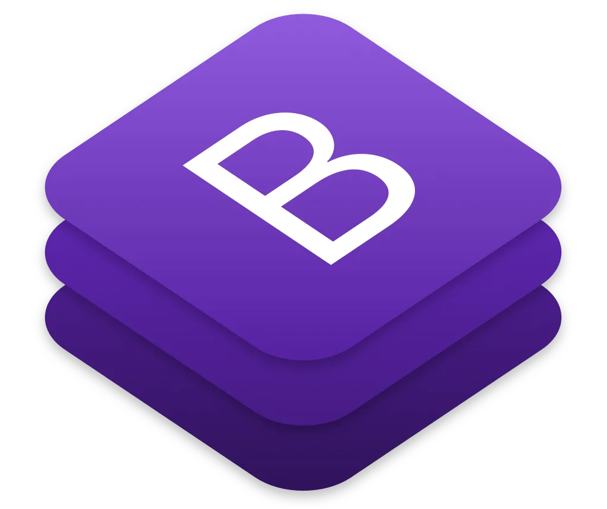
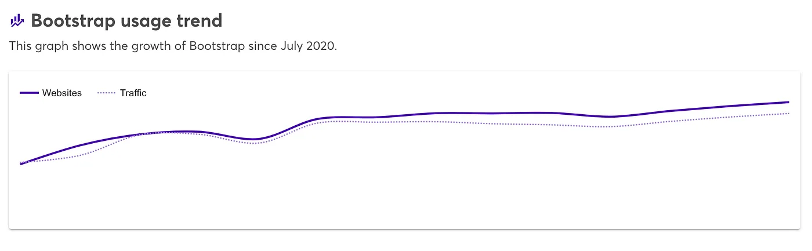
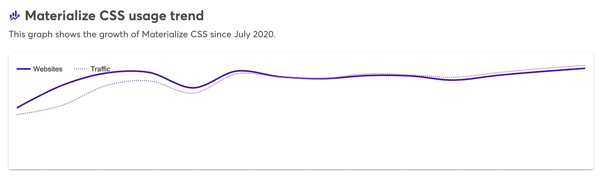
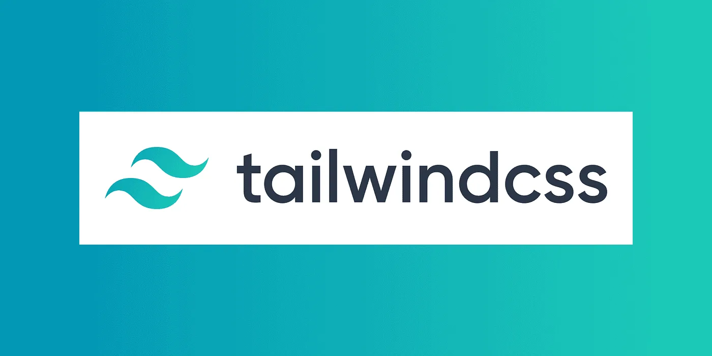
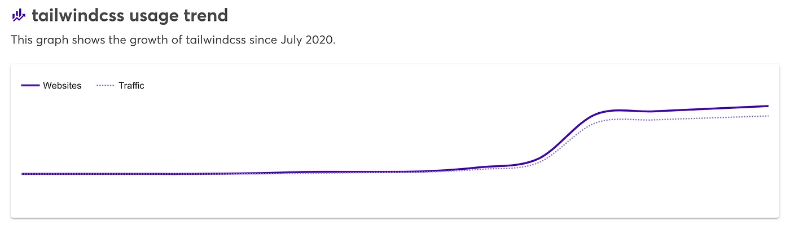

Why do we even need CSS frameworks?
-----------------------------------

First of all, let's give some thought to what’s so special about frameworks and what makes them different from libraries.

> **Libraries:** We give you features, it's your will to use them the way you like.  
> **Frameworks:** We give you features as well as rules on how to use them.

I hope the above difference was enough in itself to build some premise. CSS frameworks not only give you ready-made classes but a compliant website will use them as they were intended to be used. For example, bootstrap gives you margin sizes from 0 to 5, unless extremely necessary these will cater to your complete needs and you must refrain from giving margins in px/em units as they will break the uniform content separation ratio on the page.

The following list is from a personal perspective and may vary for you but these are the most powerful ones.

## **Bootstrap**
=============

> Quickly design and customize responsive mobile-first sites with Bootstrap, the world’s most popular front-end open-source toolkit, featuring Sass variables and mixins, responsive grid system, extensive prebuilt components, and powerful JavaScript plugins.

By far my favourite framework is bootstrap, just after few months of fiddling around you can be sure that whatever you saw on the web can be made using it. Bootstrap’s power is not limited to mere CSS but goes to define the entire UI for the project where every team member codes separately and yet produce similar-looking components magically.

> Famous sites: [_Gitlab_](https://www.wappalyzer.com/lookup/gitlab.com)_,_ [_WhatsApp_](https://www.wappalyzer.com/lookup/web.whatsapp.com)_,_ [_PayPal_](https://www.wappalyzer.com/lookup/paypal.com)_, F_[_reelancer_](https://www.wappalyzer.com/lookup/freelancer.com)

## **Material**
============

> Created and designed by Google, Material Design is a design language that combines the classic principles of successful design along with innovation and technology. Google’s goal is to develop a system of design that allows for a unified user experience across all their products on any platform.

Material(Materialize) is your go-to framework if you love the consistency of your android phone’s UI. To me, M in Material stands for Modern, it definitely looks one step ahead compared to any other CSS framework I saw. It’s available in many ready to import variants, materialize being the easiest for barebone implementation.

> Famous sites: _Youtube, Gmail, Codepen,_ _Behance_

## **Tailwind**
============

> Rapidly build modern websites without ever leaving your HTML. A utility-first CSS framework packed with classes like `**flex**`, `**pt-4**`, `**text-center**` and `**rotate-90**` that can be composed to build any design, directly in your markup.

Tailwind is a little different than any other CSS framework as it's not targeted for providing readymade components but rather gives base CSS itself. As said above, _flex_ class corresponds to adding _display: flex_ to that HTML element without involving CSS directly.

> **Famous sites: _BlaBlaCar, überdosis, Superchat_.**

Tailwind growth chart

## Conclusion
==========

Just one rule to stay ahead, pick any framework and stick to the way sites are supposed to be built using them. If you ask for a personal recommendation I’ll say use **Bootstrap** for any general-purpose site, **Material** looks great in dashboard-type systems with complex transitions and UI elements and **Tailwind** is well for experiments, especially recommended for react components.

Do follow for more [Ruby on Rails](https://railsfactory.com/hire-ruby-on-rails-developer) posts.

## To Connect
==========

🏠 Website: [https://hi-sameer.web.app](https://hi-sameer.web.app/)  
🏭 LinkedIn: [https://www.linkedin.com/in/sameerkumar1612/](https://www.linkedin.com/in/sameerkumar1612/)
