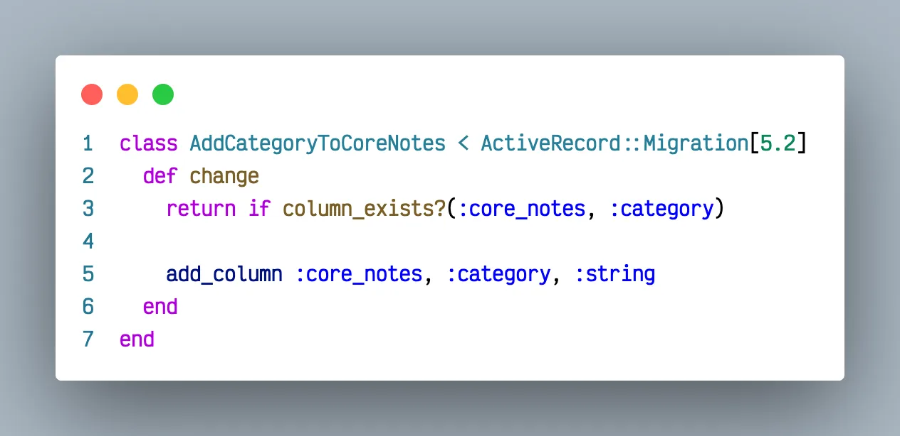
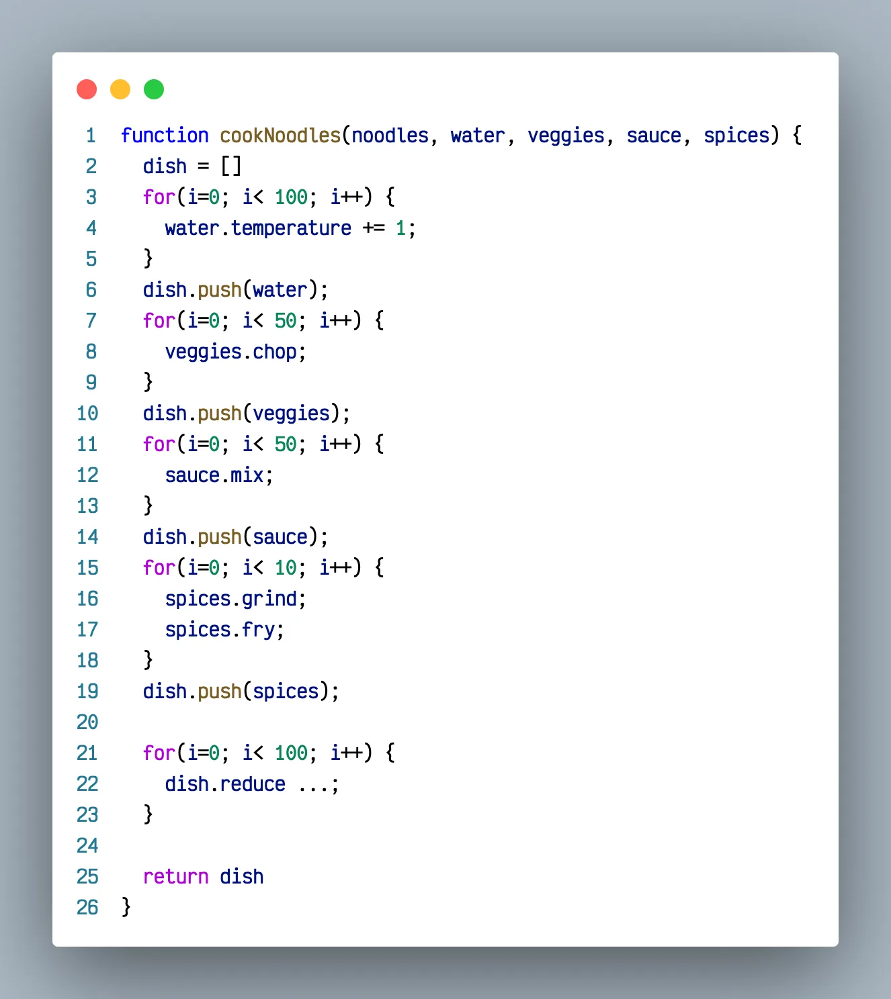
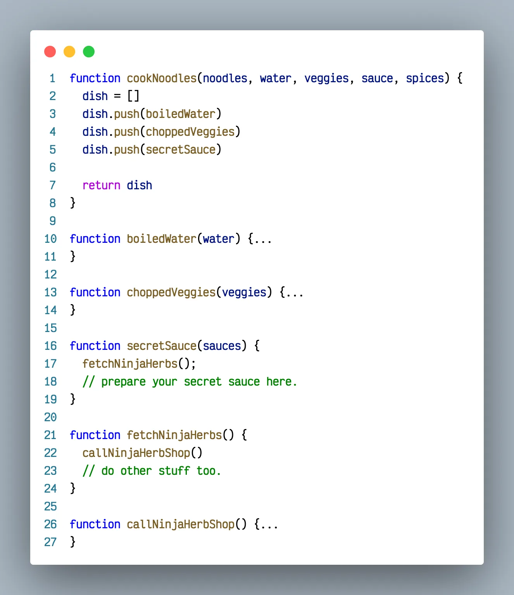

> Hey You! Don’t be afraid of these terms, read, learn and confuse others! 💁

> The first thing to note is in the title is that I didn’t mention Versus as no soul on this beautiful earth can draw a straight line between them. It’s like the Single Responsibility Principle, where you keep breaking down your application logic and still find it being violated.

So, what the heck these terms mean, lawyers reading this article please refer [wikipedia](https://en.wikipedia.org/wiki/Imperative_programming) or something, Nerds focus here: 🤓

> Imperative deals with - How to do it?\
> Declarative deals with - What to do anyway?

You can thank me later for confusing you again!

The glue that binds these both paradigms is called Abstraction. In simple terms, it just depends on how much you can hide. The more the abstraction, the more you move towards Declarative style. On the other hand, if you focus more on implementation details, you’ll be leaning towards imperative style.

Take a simple example: We all are engineers some way or other, so once in our college days we must have come across, “Drawing a line using c programming language or any canvas-based system”. That was too Imperative to be happy at the same time.

Now, come to our beloved HTML land.

_`<hr>` # Ok, Tata, Bye bye._

Conclusion to be drawn that, in HTML we want a line, we ask for a line and get a line. No pixel-level shenanigans.

So, the new kid on block, React has become even more Declarative than Html itself. When we set the state of a text shown on screen to something else, well have you ever thought about how it happens in the background. In vanilla Html js style, you must have thought about putting an ID and binding it to some Javascript variable and some more ninja stuff to get it done.


One common example using sql will be like:

```sql
Select * from users where name=“Sameer”;
```

Now, have you told sql how to do a match, whether indexes are available or not, what order it should scan table, engine specific implementation or anything such. For that matter anything on how to get data from the db except for what to get.

Essence here is that you can always make anything more Declarative by putting lot of abstraction makeup on it.


And when this makeup reaches ultra pro max level, it becomes a DSL.

Languages like ruby are fan of DSL. DSL stands for Domain Specific Language. It represents that extremity when a language can fit only one domain.

Yeah react too has a DSL, yeh you guessed it right JSX, it is so modified version of Javascript that it can only create markup elements. You do a **`<button className=”tomato”>`** and then leave it to JSX to handle how original element gets prepared for DOM tree and how that className becomes class.

> JSX is that branch of js which is only suitable for writing components.\
> Can we write a javascript generator function in it? Well is it even meant for it.

For rubyists: Here in this database migration, we are asking to add a category column to core_notes table.

> _Do we care about how this will work. Hell no !\
> Can we use migration syntaxes in general ruby code. Not fully, its made for migrations !_


_An example of database migration adding category to notes table._

So, DSL can be considered as that manifestation of language when its good enough for solving problems in one specific domain.

That was all for theoretical stand point. What is use for the jargons for us, the developers. 🤔

> Learn to perform top-down decomposition of codebase.

What do I mean by that? Glad you asked.

> Imaginary problem time:\
> We are gonna cook noodles and its gonna be Legen-wait_for_it-dary.


_Just some gibberish code to irritate you._

If you see above code as algorithm for cooking noodles, will you even be interested in eating after all. Thats a lot imperative but less impressive.

Let’s write it as civilised human beings now:


_Notice the smooth flow of control._

The secret for best decomposition is to assume your first function is being read by a business manager or any non technical person and only focused devs will ever reach your last ones.

## So, what we learnt today:

> These paradigms are like a number line, Imperative on left and Declarative on right. You can always move toward one paradigm but never reach the ultimate end. On left you'll find your language to be more general purpose and on right it takes path to become a DSL.

This was an attempt to dive into less explored zones of software development and if you like it or otherwise, do provide your suggestions. These things won’t help you start writing codes right away but will definitely upgrade you to a better engineer in some capacity. 👨‍💻