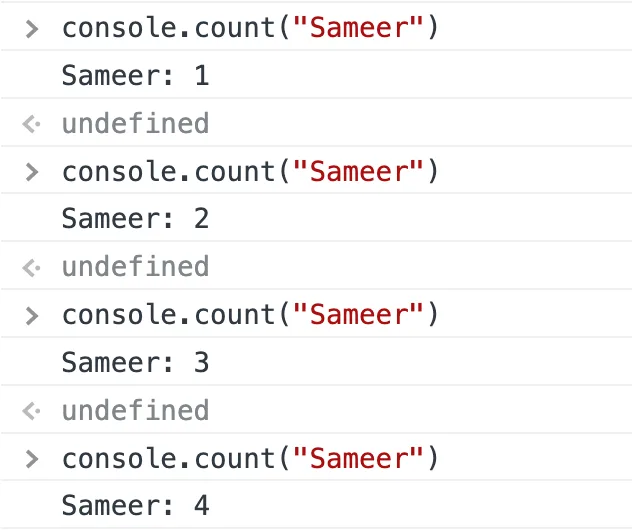
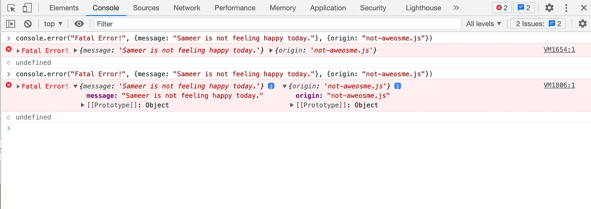
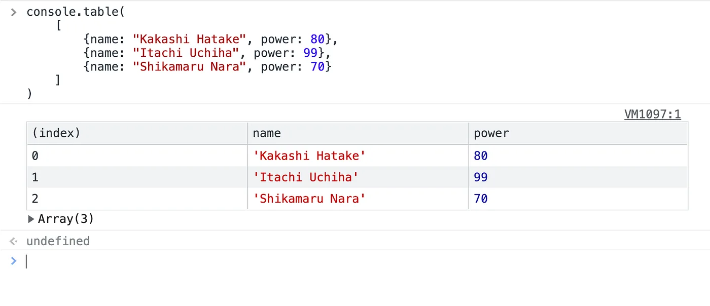
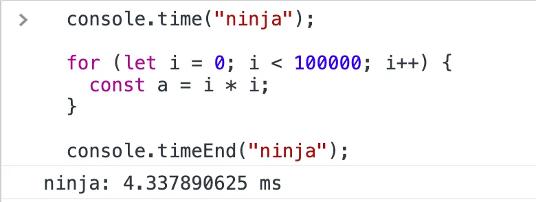
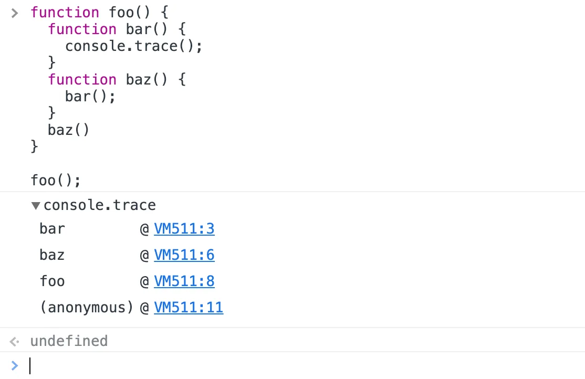
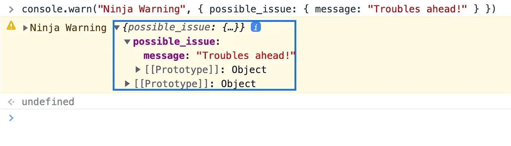
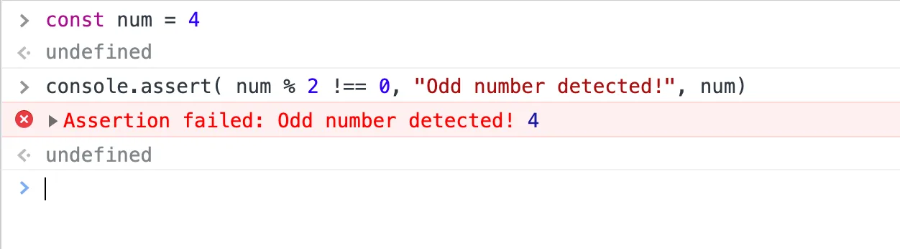

> Swiss knife of javascript ninjas, our beloved console.log has some lesser-known yet more powerful variations. In this blog, we’ll explore some methods with examples which I find very useful in day to day debugging and scripting.

---

The `console` object provides access to the browser's debugging console (e.g. the [Web console](https://firefox-source-docs.mozilla.org/devtools-user/web_console/index.html) in Firefox). The specifics of how it works vary from browser to browser, but there is a _de facto_ set of features that are typically provided everywhere. It provides a set of methods and formatters to show information in the browser console in a more user-friendly way depending on the type of data being passed to the specific method. Since everyone is already familiar with the`log` method, we’ll look into the rest.

---

## console.count()

> The count method can be used to display the number of times this message was shown on screen.

---

## console.error()

> The error method is the correct way to log error messages to the console, which uses browser tooling for proper representation of the error and semantically justifies the log. Also, you’ll find count on top of the console reflecting the number of errors _[ x 2 ]_.

---

## console.table()

> The best of all the methods and my personal favourite. Really useful to debug API responses which contain an array of 100s of similar objects. Instead of opening each and looking into them, we can have a flat tabular representation.

---

## console.time()

> A quick and dirty way to measure the performance of your javascript code. You can get a benchmark of some intensive operations or find which operations are taking the longest in a chain using this method.
>
> _Woah! Javascript and new macs are_ **_fast!_**

---

## console.trace()

> When things get serious, you may need to solve the chicken-egg problem, ie, which method was called first. Especially troubles get more troublesome when playing the async game.

---

## console.warn()

> A semantic way to handle non-nuclear threats thrown by your application. A possible use case can be if your user is about to hit a certain limit, you can log some warning messages, until finally throwing an error. Or, most commonly seen in deprecation warning of certain functions.

---

## console.asset()

> Sometimes it's not worth logging every time. Maybe say, we are tracking mouse movement and need a message if the mouse cursor moves outside a box. To help in such situations, assert does conditional logging whenever the provided condition in the first parameter is false.

---

## Conclusion

So, ninja pals, today we have learnt about many ninja tools that the console provides us with. These methods can make our stressful debugging moments a little bit happier and add a lot of semantic meaning to the power of almighty **console.log(“Live Long and Prosper…”)**.