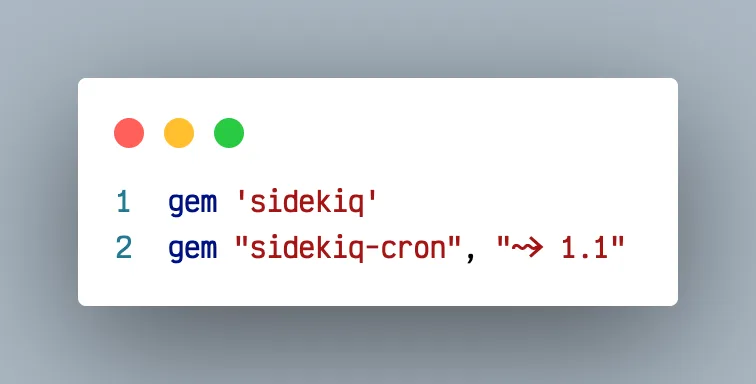
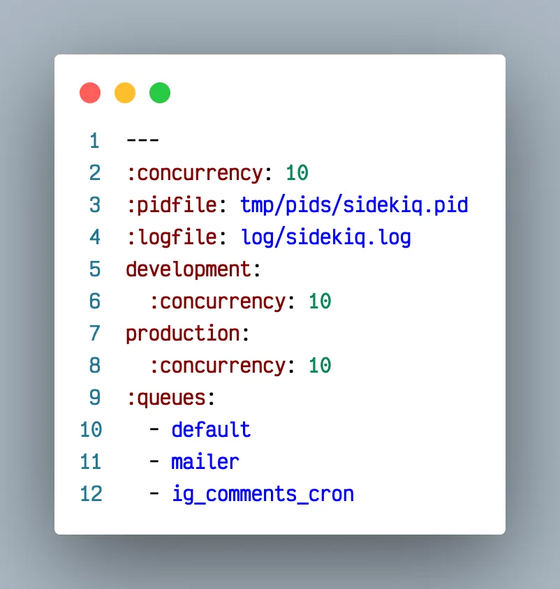
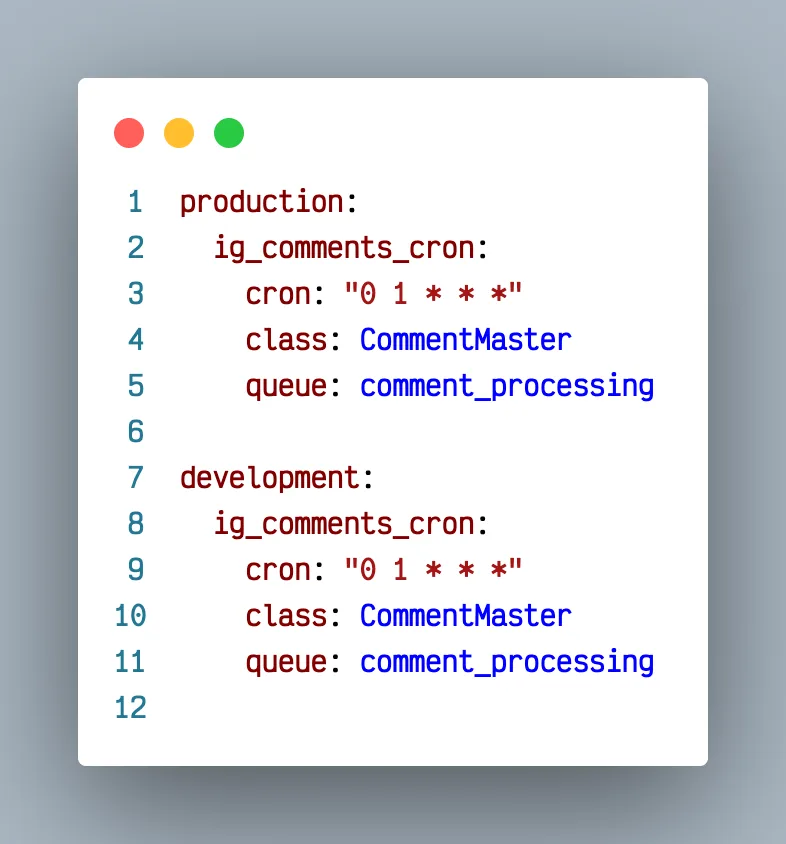
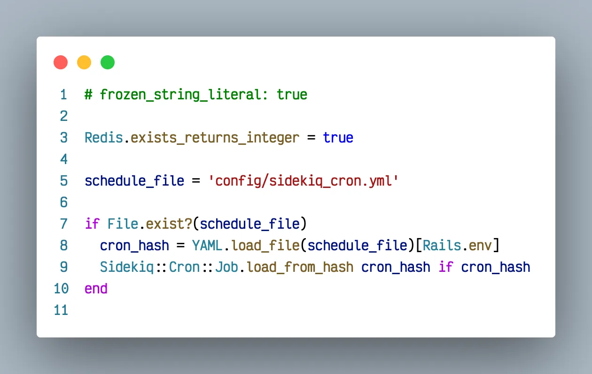
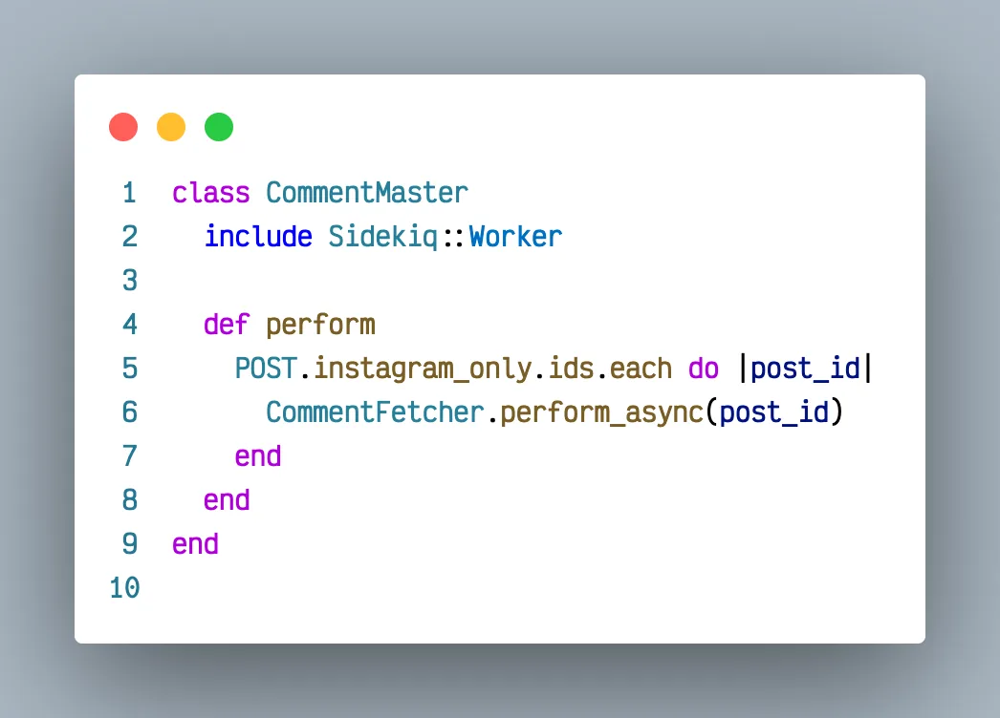
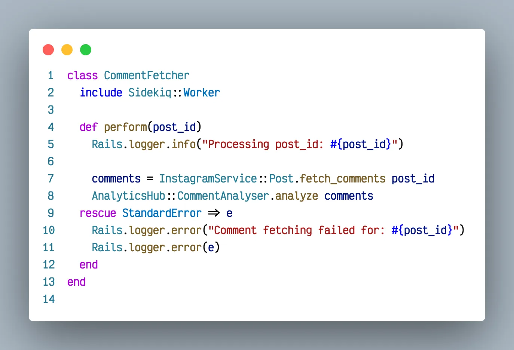

## Introduction
============

😇 Well hello, and welcome back. In this article, we’ll discuss parallel execution and background processing of heavy tasks. An awesome developer like you does often write some mundane tasks to run in the background every night or so but you also want an army of elves to take control of the process and finish it as quickly as possible and not leave any mess behind. One night I didn't sleep and watched the process and those dudes were pretty darn organized. So, let's discuss their workflow and try learning a thing or two.

## Imaginary problem time
======================

We are  a top-secret agency monitoring whatever folks are posting on social media these days. I heard this Instagram thing is getting quite popular these days. Our plan goes like this, **Every hour**, we’ll use Facebook graph API and pull in all comments on these posts and pass through some AI magic which will give some info on the type of person the commenter/influencer is. To begin let's say we have 1000 posts to monitor, carrying maybe 5000 comments each.

**The problem** begins when we realise that these many calls will take long time to process and our server will always be busy. Hell, if we encounter one of those viral posts containing 100K comments, our processing will surpass a whole hour for it and we’ll not be able to do anything. **SHAME ON US!**

## Technologies
============

*   Sidekiq — Gem to schedule code to run in future.
*   Sidekiq-cron — Gem to run cron jobs (same task after certain interval, like daily/hourly).
*   Redis — An in-memory database to track state of our async jobs.

## Setup and Codes
===============

For this example we’ll be using famous **sidekiq** and **sidekiq-cron** gems. Sidekiq is an easy to use scheduling gem, which essentially means that it can used to process some task at certain point of time in future.

Gemfile
config/sidekiq.yml
config/sidekiq\_cron.yml
config/intializers/sidekiq.rb
app/workers/comment\_master.rb
app/workers/comment\_fetcher.rb

## Explanation
===========

I know you did not go through above codes line by line, so now take a deep breath and focus. Above setup created a queue to manage all comment related jobs and that weird **“0 1 \* \* \*”** meant that that CommentMaster class’s perform method will run once every hour.

Coming to CommentMaster class, you’ll find it calling CommentFetcher’s **perform\_async** method for all posts at once. This perform\_async is a special method provided by sidekiq to call that method asynchronously. Ah! Sweet smell of JavaScript.

Looking at the bigger picture, 5000 jobs will be submitted at once to process our 5000 posts and will get scheduled in the queue. Notice the **concurrency = 10**, it means that 10 jobs from that queue will run in parallel.

Major benefit comes to light when we understand that any one job failing doesn't impact others, no matter if its an alien attack error situation too. Had we ran with perform instead of perform\_async, any uncatched error would have terminated the loop, because former is just like calling a method in loop. Paranoia is all good but it’s not possible to wrap up everything in exception rescue blocks, so our some elves(workers) will die while processing job, leaving an error log for us to refer later.

## Conclusion
==========

Hence, this strategy of using one master as cron’s reference and delegating work to parallel workers will make our work 10 times faster and even if that viral post comes in, 9/10 workers will be free to tackle next hour workload.

Do follow for more [Ruby on Rails](https://railsfactory.com/hire-ruby-on-rails-developer) posts.

## To Connect
==========

🏠 Website: [https://hi-sameer.web.app](https://hi-sameer.web.app)  
🏭 LinkedIn: [https://www.linkedin.com/in/sameerkumar1612/](https://www.linkedin.com/in/sameerkumar1612/)
