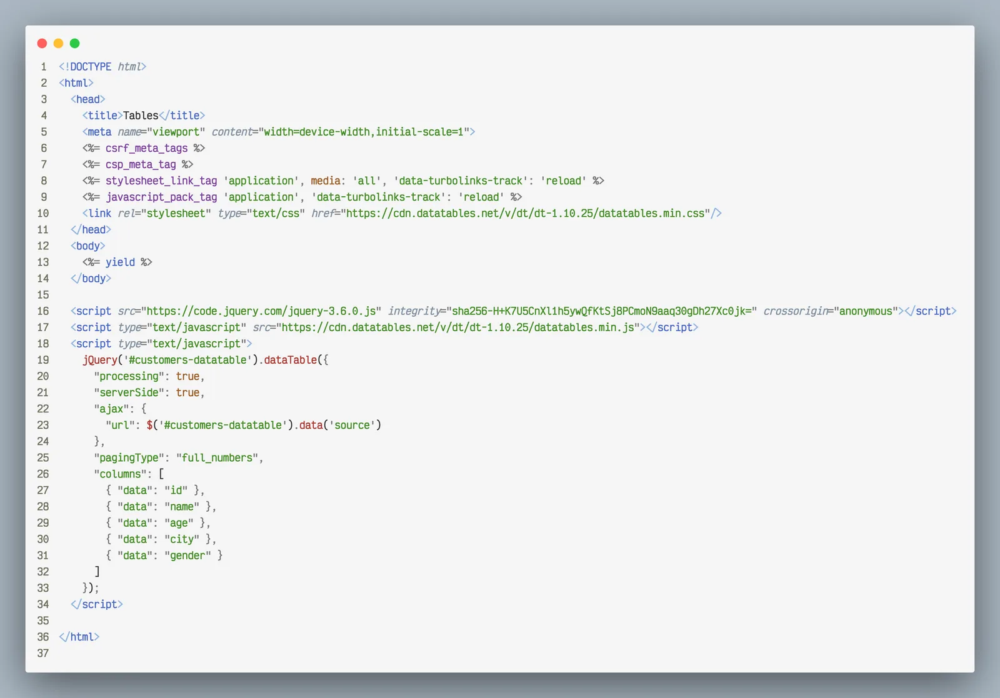
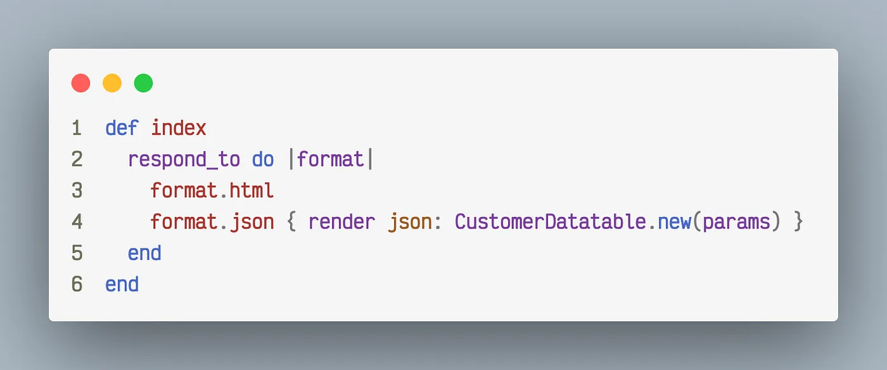
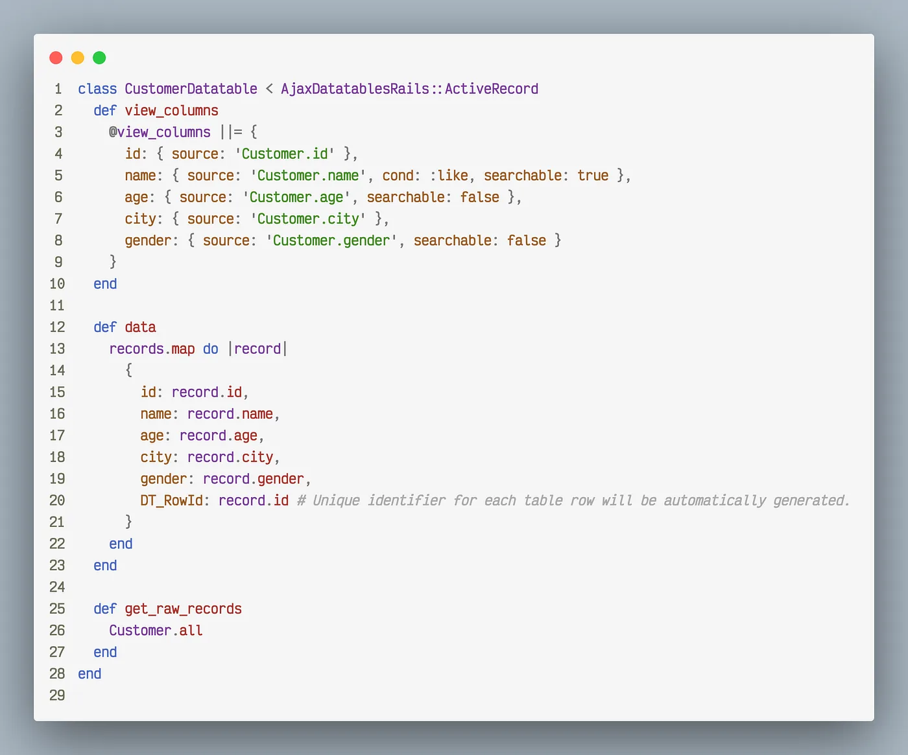
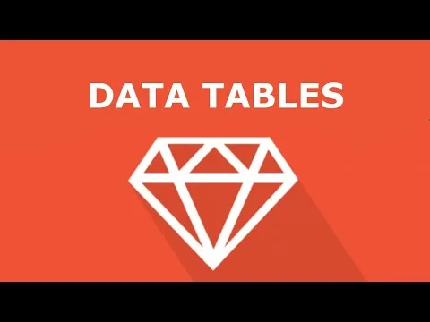

> You are a developer full of joy and enthusiasm toward changing the world, writing ninja codes driving million-dollar businesses every day. And, then you have to write codes for displaying customer/products/orders data in a table and you spend a month writing pagination, sorting, searching, async fetching and blah-blah. Well, let me help you then by opening gates to datatables.

## Introduction

Since you already are an awesome developer, I’ll skip the formal introduction and let’s get started by knowing how our new friend is going to help us:

1. You don’t need to loop through @orders and display each object in your view file.
2. No table or list tags need to be implemented and managed explicitly.
3. No backend logic needs to be put in your controllers for sorting and filtering data displayed.
4. Uniformity for all such tabular implementations.
5. Lesser the code, the Happier the developer. 💁

## Setup

- **rails new tables -T**\
  \# -T skips testing from your application. We won’t need it for our demo app.
- **Add the following gems in your Gemfile:**\
  _ajax-datatables-rails\
  jquery-datatables_
- Let's quickly scaffold a model, say, the **Customer**:\
  _rails g scaffold customer name age city gender_
- Time to scaffold a datatable for our lovely customers:\
  _rails g datatable Customer_

> **Let’s start implementing datatable now. Our target to hook up datatable in UI and exchange data without page refresh.**

First, we’ll modify **_app/views/customers/index.html.erb_** _as:_

Well, since this is just a demo, let’s go the dirty way and hook scripts right in our view files. But, beware if you do in your actual application, Hell is a sure thing for you.

What you need to notice here is that we are using a table tag with a data-source attribute assigned to _UsersController’s index route._ Rest we don't need to provide any data in the table body. After all, if we do everything, what datatable is for.

_Only index route changed in Customers Controller_

Now, its time for putting some logic in the datatable file we generated earlier, our **_app/datatables/customer\_datatable.rb_** will now look like this:

- **view_columns**: These are actual binding for the data you are going to display. The _source_ key is essential for any operation on data. By default, all columns are sortable and searchable, so this is the place where you can enable or disable properties on the column.

- **data:** This method essentially generates all the entries which are going to go in the table we created earlier. This is the place where you can customize your data. For example, let's say if we want to colour-code genders as pink and blue text, we can easily put a ternary in place of record.gender and surround each case with some HTML tags.

- **get_raw_records:** This is the source of data. records variable which you saw in the data method gets its value from the query we run here.

## Let’s try to run now

👉 Github codes for this demo: [github.com/sameer1612/datatable-demo](https://github.com/sameer1612/datatable-demo)

## That’s all Folks! Easy Peezy.

> I am planning to write on [Ruby on Rails](https://railsfactory.com/hire-ruby-on-rails-developer), every Sunday. I am not familiar with medium platform but if it supports, consider subscribing. _🙌_
>
> 👉 This article is written considering the reader is fresher to rails, so, reserving in-depth exploration for part 2. Stay Tuned!

If you have any doubts, put them in the comments, I’ll answer asap. Also, if you want to know about some specific topic, do mention, I’ll definitely write on it soon.
