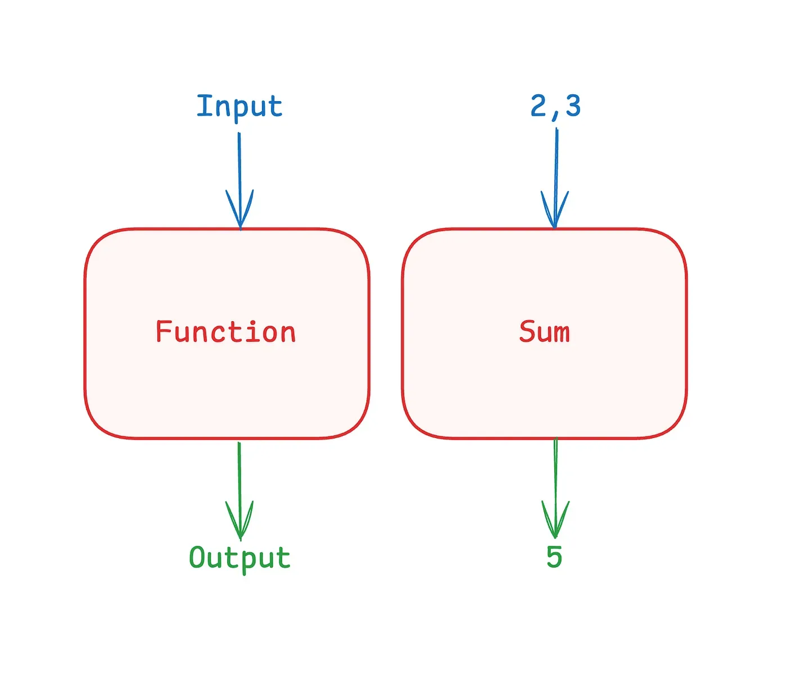
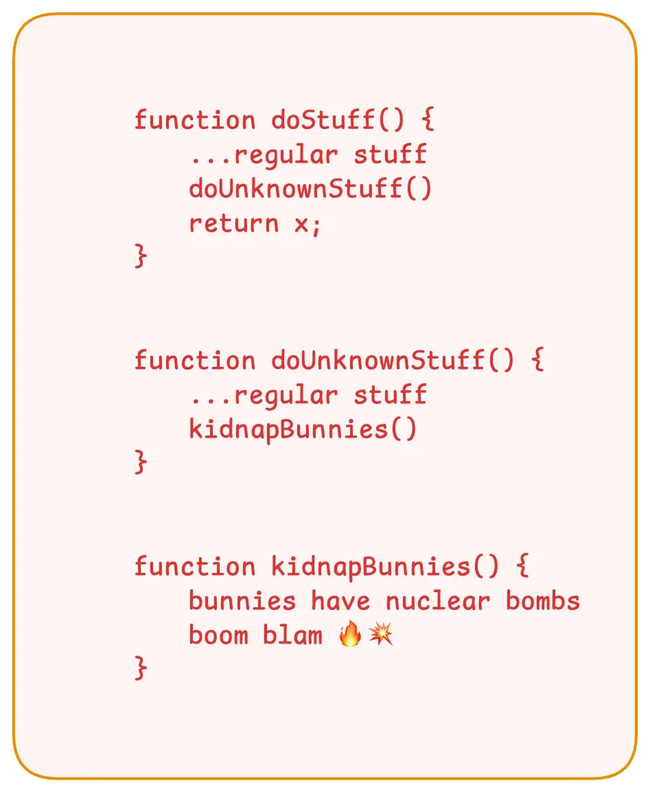

Functional programming (FP) is like the cool, rebellious middle child of the programming (language) family. Instead of following the traditional imperative way of doing things step-by-step, FP focuses on creating clean, predictable code by treating functions as first-class citizens. It’s like the stand-up comedy of coding: sharp, witty, and always on point.

A lot of jargon in the introduction itself? Thought so.

> Some quick bullet points to wash off that cult image of FP

*   There isn’t a clear line dividing functional programming languages from other languages.
*   You can write functional code in almost all languages. Even in boundaries of strict OOP languages.
*   Your code doesn’t need to be 100% functional. Try to keep it as immutable and pure as humanely possible.
*   FP doesn’t make you cool. It may do a little bit of idiot-proofing though.


Today we’ll go through a few jargon to set the stage for upcoming adventures. I’ll stick to dumb JavaScript for code examples. Let’s keep Haskell/Elixir show off for later, hold peace it’ll come.

1.  Pure functions
2.  Immutability
3.  Side effects
4.  Higher order functions

**Pure functions**
==================


The simplest and most important concept of functional programming is to make code outputs consistent. The same input(s) should give the same output. As simple as that. No T&C applied.



You send `2` and `3` to a function called `sum`. It should always give you `5` and never 23. Javascript joke!

So you ask: Dear Sameer, it’s dead simple to ask for any computer program let aside this FP. Doesn’t all code work like that, or at least should work like that?

Well easier said than done in large codebases where everything is like a mess of randomness. Let’s take a few simple examples.

Pure functions:

```
function add(a, b) {
    return a + b;
}

// Example usage:
console.log(add(2, 3)); // 5
console.log(add(2, 3)); // 5
```

```
function toUpperCase(str) {
    return str.toUpperCase();
}

// Example usage:
console.log(toUpperCase("hello")); // "HELLO"
console.log(toUpperCase("hello")); // "HELLO"
```

Impure functions:

```
let counter = 0;

function incrementCounter() {
    counter += 1;
    return counter;
}

// Example usage:
console.log(incrementCounter()); // 1
console.log(incrementCounter()); // 2
```

```
// Outputs a random number between 1 and 10
function getRandomNumber() {
    return Math.floor(Math.random() * 10) + 1;
}

// Example usage:
console.log(getRandomNumber()); // 2
console.log(getRandomNumber()); // 6
```

However rudimentary, that gives a general idea. A pure function will always be consistent. Impure ones can and will backstab you in most unexpected places. Imagine, one time your bank account shows $150,000 and you refresh the page to see $150. Good enough for a minor heart attack, aye?

**Immutability**
================

Let’s define mutation first


> No change == No mutation == Immutability == Trust

Now that we have semi-formally defined it, let’s look at how it works. After all, programming is all about changing one data into another. We’ll write a small mutable code and see the perks of its immutable version.

```
function updateAge(obj, newAge) {
    obj.age = newAge;
    return obj;
}

// Example usage:
const person = {
    name: 'Alice',
    age: 25
};
console.log(updateAge(person, 26)); // { name: 'Alice', age: 26 }
console.log(person); // { name: 'Alice', age: 26 }
```

Let’s dissect. Good Alice is 25 years old, to begin with. If I come to the last line directly and want to know the age of Alice(aka `person`), I’ll have to track this `person` object everywhere and carefully understand who modified it and “how”.

Let’s fix this mutation:

```
function updateAge(obj, newAge) {
    return { ...obj, age: newAge };
}

// Example usage:
const person = {
    name: 'Alice',
    age: 25
};
console.log(updateAge(person, 26)); // { name: 'Alice', age: 26 }
console.log(person); // { name: 'Alice', age: 25 }
```

Now, anywhere we meet this `person`, we are guaranteed to know its state by seeing it’s original definition. If this new value is required for something, go ahead and keep it in a new `updatedPerson` variable. If someone later wanna know the age of `updatedPerson` , he’ll just jump to the place where it is first defined. Savvy?

Benefits you ask. Here are a few:

1.  It becomes easy for the language’s internal tools to clean the used memory, aka, garbage collection.
2.  An implicit guarantee that value will remain consistent throughout the life of a variable.
3.  A ton of predictability in the code. You can just skim a few lines and tell what the value is at any point in time, without reading the entire code.
4.  **Idiot proofing. You know that someone else won’t modify what you read the first time. Ah! Do those edited WhatsApp messages ring a bell?**

Higher order functions
======================

This one ain’t much. Simply said, a function can take and return functions too, just like it plays with regular data.

Depending on your previous programming experience this may look normal or whaaaat. I expect no in-between experience.

When you treat functions as first-class citizens, you can do some pretty amazing things by combining or passing them around. Let’s see a few examples:

```
// High-order function that returns another function
function makeMultiplier(multiplier) {
    return function(number) {
        return number * multiplier;
    };
}
```

```
// Example usage (custom tailored functions on the fly)
const double = makeMultiplier(2);
const triple = makeMultiplier(3);console.log(double(5)); // 10
console.log(triple(5)); // 15
```

```
import {map} from 'lodash';
```

```
const numbers = [1, 2, 3, 4, 5]; // This map function takes a list of some data and a function.
// Basically running the same function on each item in the list.
const doubledNumbers = map(numbers, number => number * 2 );// Example usage
console.log(doubledNumbers); // [2, 4, 6, 8, 10]
```

**Side Effects**
================


Here the real trouble starts. As the name suggests, your code will poke its nose into things that are beyond its scope. If the function modifies or triggers something that’s outside its scope, it can wake the dead from graves. We may never know the full extent of what this external call did until you are neck deep in that call stack rabbit hole.

Too many fancy words? My sympathies. Let’s see the code you wrote some days back.



Yeah Yeah Yeah! Now you tell me that you didn’t know that bunnies too have nukes. Classic!


Let’s create a cocktail of what we learned from pure functions and immutability. Side effects totally rack jacks our two beloved concepts.

```
const numbers = [1, 2, 3];

export function addNumber(number) {
    numbers.push(number); // Modifies the original array
}

export function viewArray() {
    console.log(numbers); // Prints numbers array
}

// Sinjo calling same method in different files
viewArray() // 1,2,3
viewArray() // 1,2,3
viewArray() // 1,2,3

// nastyuser_123 called it somewhere randomly
addNumber(4)
viewArray() // 1,2,3,4
```

These functions are making side effects on the numbers array. Our good user Sinjo is compulsively printing arrays using `viewArray` function and getting the same results everywhere, pseudo-smiling in purity. Then someone called this `addNumber(4)` and now his system is broken and he doesn’t even know why.

Sinjo wants answers, Sinjo wants justice! ❤️‍🩹


That’s all folks for today. Reflect on this jargon list. Whatever we went through should give a clear idea about what problems we are trying to solve. In the next piece, we’ll get our hands dirty with some deeper concepts. Ciao.

Want to connect?
================

[LinkedIn](https://www.linkedin.com/in/sameerkumar1612/)

[Website](https://hi-sameer.vercel.app/)
