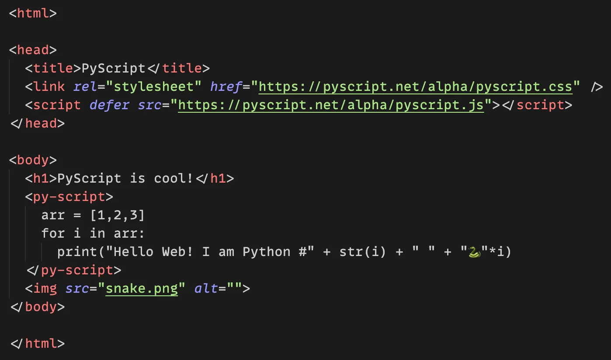
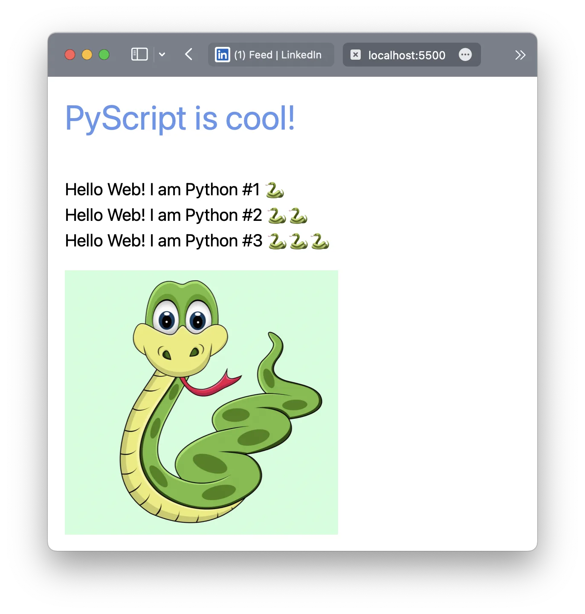

🐍 Python in browser movement gained some momentum nowadays. All thanks to the PyScript library. See how easy it is to bring it into a simple HTML page with no additional setup:

Although the current version is not that mature it holds a ton of potential.

> It's WebAssembly magic under the hood... 😉

Personally, the benefits I see are:

1. Running complex data structures in the browser.
2. Not depending on python installation to run python.

## Do share your thoughts and use cases for it.
