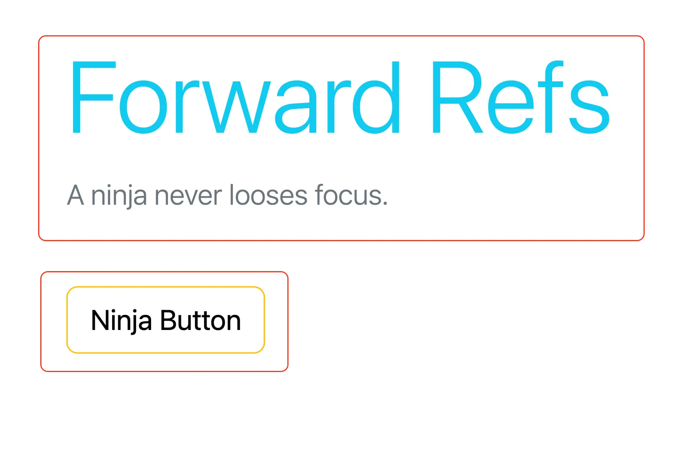
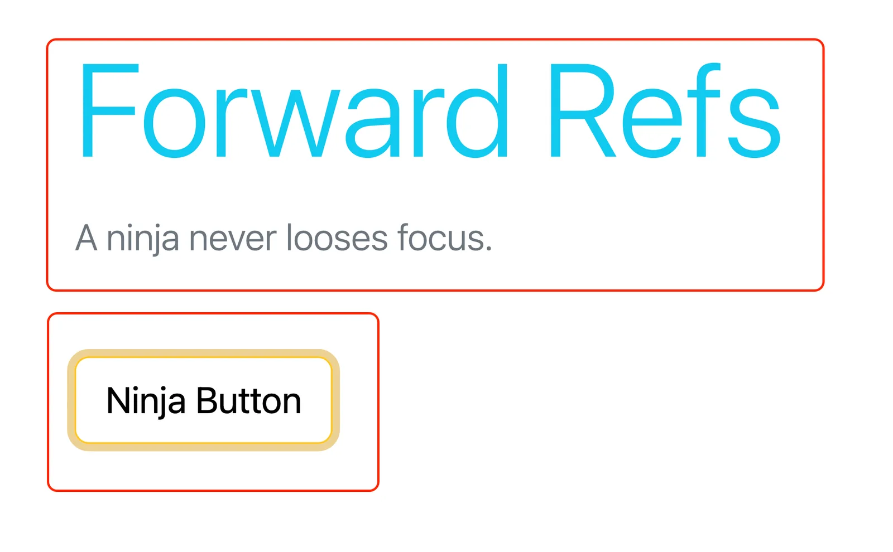
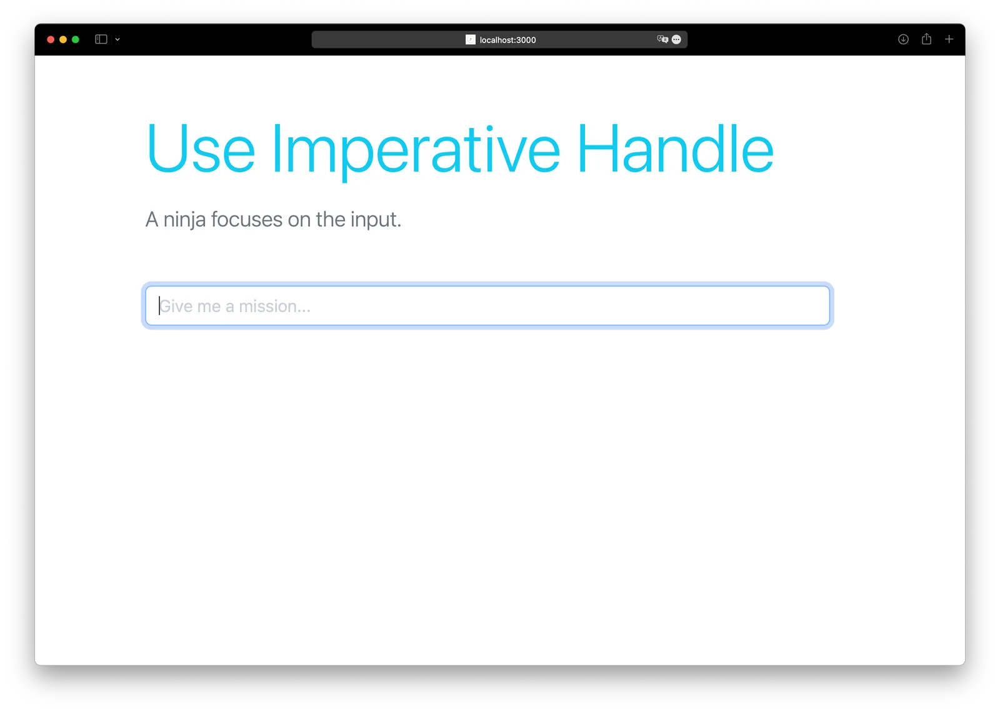
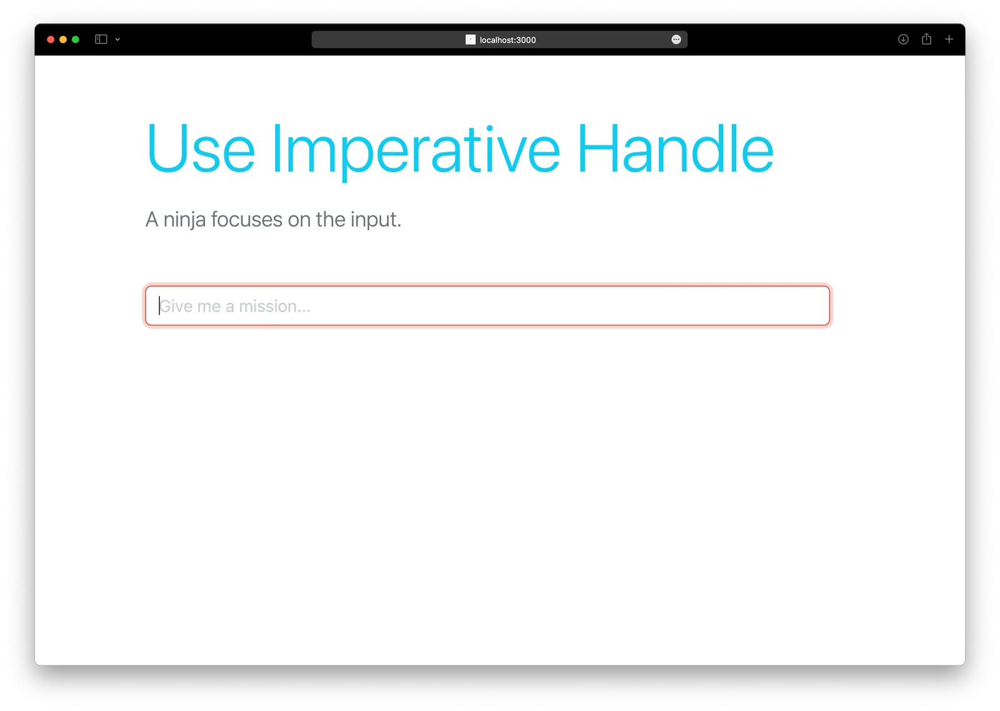
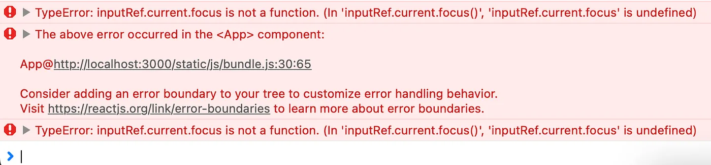

> Sometimes, you have to take out the big guns

This article is a continuation of [React v18: useRef — What, When and Why?](/blog/react-v18-useref-what-when-and-why) where we saw what refs are and how they operate. With the knowledge gained from the previous article, let’s dive into a little more complex understanding, which can come in handy in real-world projects with a lot of component nesting and a bit of real DOM-based needs.

## Forward Ref

What’s a solution without a problem, right? So, let’s define a situation where regular refs can not get the job done. What if we have a parent component that wants a reference to one of the elements defined in the child component and modifies the focus state? Let’s create such an example.




_The parent component controls the focus of the button defined in the child component._

As you can see above, the parent component controls the focus on the child component’s button. It is not as simple as passing the ref defined in the parent as a prop to the child. In our case, ref is a special property defined on the exact HTML element whose focus is to be changed, not the child component wrapper, as it’s just a function.

We can attain the desired behaviour by wrapping our child component into a `forwardRef` function provided by React, which will handle this delegation. This function should transfer the sent props and allows one extra prop on the component, that being our “ref.” Here’s the code:

```jsx
import React, { useEffect, useRef } from 'react';

export default function App() {
  const btnRef = useRef(null)

  useEffect(() => {
    btnRef.current.focus()
  }, [])

  return (
    <div className="container">
      <p className="text-info display-2 mt-5">
        Forward Refs
      </p>
      <p className='lead text-secondary mb-5'>A ninja never looses focus.</p>
      <NinjaButton ref={btnRef}>
        Ninja Button
      </NinjaButton>
    </div>
  );
}

const NinjaButton = React.forwardRef((props, ref) => (
  <button ref={ref} className="btn btn-warning bg-transparent btn-lg">
    {props.children}
  </button>
));
```

## useImperativeHandle

Well, seemingly, what we achieved in the previous section is enough for even complex situations. Still, at times you may be tempted to define a custom ref functionality inside your component, which will be exposed to components using it. Let’s try to create a situation where we need such fine-grained control.

By default, the focus colour on input is `blue` but let’s say if our ninja is supposed to get a supercritical jonin level mission, then the input field should focus on `red` instead.




_The parent component can control which colour the child’s input focuses on._

To illustrate the use of `useImperativeHandle` in this case, let’s divert from common sense and build two custom methods tied to the input component through ref. Instead of the default focus method, this time, we’ll have two custom methods `focusRed()` and `focusBlue()`.

We’ll still need to use `forwardRef` to pass on the ref to the child component, but inside the child component, we’ll create these new functions with the help of the `useImperativeHandle` hook. Here’s what the code looks like:

```jsx
import React, { useEffect, useImperativeHandle, useRef } from 'react';

export default function App() {
  const inputRef = useRef(null)

  useEffect(() => {
    Math.random() > 0.5 ?
      inputRef.current.focusBlue() :
      inputRef.current.focusRed()
  }, [])

  return (
    <div className="container">
      <p className="text-info display-3 mt-5">
        Use Imperative Handle
      </p>
      <p className='lead text-secondary mb-5'>
        A ninja focuses on the input.
      </p>

      <NinjaInput ref={inputRef} placeholder="Give me a mission..." />
    </div>
  );
}

const NinjaInput = React.forwardRef((props, ref) => {
  const localRef = useRef();

  useImperativeHandle(ref, () => ({
    focusRed: () => {
      localRef.current.classList.add('focus-red');
      localRef.current.focus();
    },
    focusBlue: () => {
      localRef.current.classList.remove('focus-red');
      localRef.current.focus();
    }
  }));

  return <input ref={localRef} className="form-control w-50" placeholder={props.placeholder} />;
});
```

> One important thing to notice is that in the code above we are not extending the methods available by default as in previous case but creating totally a new set of methods. So, the `default focus()` method is no more available to us and calling it will give us sweet errors.


_The focus method is not available when using the imperative handle._

## Conclusion

To sum up, I’ll repeat what I said in the previous article: Refs to DOM themselves should not be used when doing a virtual dom-based development because the changes you make in the real DOM don’t get properly transferred to the vDOM setup, and that leads to unexpected reactivity.

I chose `focus` as the central topic for this article just because it’s one of the main needs when refs need to be summoned. React mentions a limited set of use cases for refs, which you can see here: [reactjs.org/docs/refs-and-the-dom.html#when-to-use-refs](https://reactjs.org/docs/refs-and-the-dom.html#when-to-use-refs).
