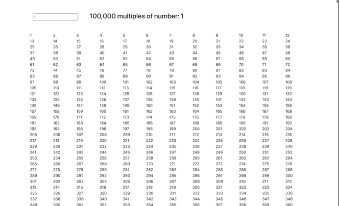
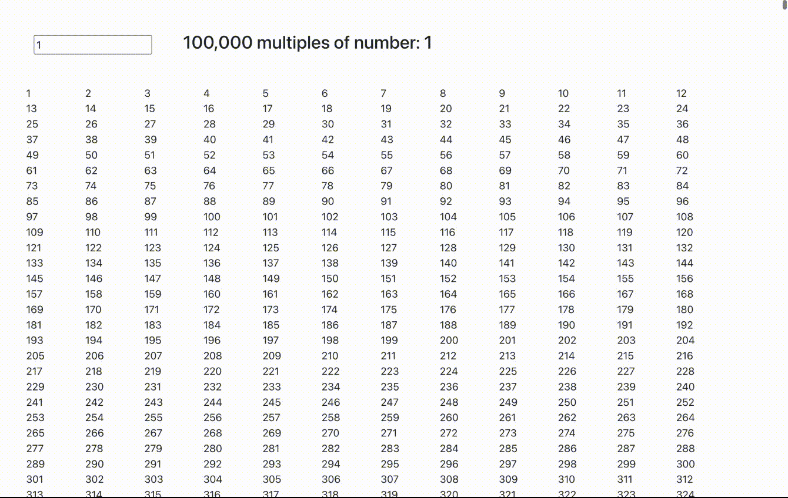

**React v18** introduced the **useTransition** hook, which may seem like just another hook but let’s look into the use and the indications it lays down for the future.

Long long back, React hinted about the concept of concurrent mode, whose implementation was a mystery in itself. However, the goal was to draw a line between the slow intensive operations and much needed faster UI interactions in complex applications.

**One practical problem** that I landed into as a fresher was while building a search component which used to fetch recommendations from the backend on every keypress. I refactored it with the debounce mechanism to avoid hitting the backend too much.

> In short debouncing means that, you only perform a certain action in fixed intervals of time. In my case, hit the API after 2 seconds of the key press and cancel the ongoing API call if another keypress was registered then.

If we reflect, then we can understand that the solution was to move heavy API operations out of the main typing flow in the search box. Had it been sequential, it would feel very sluggish to type in the input field.

Conceptually, react did the same thing with this hook. It allows you to move your heavy logic out of the main flow into the startTransition method which works independently of the typing flow. This results in splitting the work into high and low priority queues. This is an “apparent” performance gain and shouldn’t be confused with some automatic optimization of application from react side. The speedup is for the end user’s experience, whereas for react amount of work done is the same. Do note that, it's not skipping any operations in between, i.e, calculating UI based on the state of input at the time of rendering, it’s just changing the priority of rendering multiples table and the input process.

-------

Let’s see it in action now. In our demo application, we are going to print 100,000 multiples of the number being typed into the input. This calculation is a fairly heavy operation which will slow down our application.

```tsx
import { ChangeEvent, useEffect, useState } from "react";

export default function App() {
  const [num, setNum] = useState(0);
  const [multiples, setMultiples] = useState([] as JSX.Element[]);

  function generateMultiples(num: number) {
    setMultiples(
      Array.from(Array(100000).keys()).map((i) => (
        <div key={i} className={"m-0 p-0 col-1"}>
          {num * (i + 1)}
        </div>
      ))
    );
  }

  useEffect(() => {
    if (num > 0) {
      generateMultiples(num);
    }
  }, [num]);

  const onChange = (e: ChangeEvent<HTMLInputElement>) => {
    setNum(Number(e.target.value));
  };

  return (
    <main className="container my-5">
      <input type="text" name="num" id="num" value={num} onChange={onChange} />
      <span className="ms-5 mt-3 h3">100,000 multiples of number: {num}</span>
      <div className="multiples row mt-5">{multiples}</div>
    </main>
  );
}
```




-------

Putting the useTransition hook to use now for generating multiples. It provides a boolean flag to know if the process is completed or not and a startTransition function which wraps the intensive process.

```tsx
import { ChangeEvent, useEffect, useState, useTransition } from "react";

export default function App() {
  const [isPending, startTransition] = useTransition();
  const [num, setNum] = useState(0);
  const [multiples, setMultiples] = useState([] as JSX.Element[]);

  function generateMultiples(num: number) {
    startTransition(() => {
      setMultiples(
        Array.from(Array(100000).keys()).map((i) => (
          <div key={i} className={"m-0 p-0 col-1"}>
            {num * (i + 1)}
          </div>
        ))
      );
    });
  }

  useEffect(() => {
    if (num > 0) {
      generateMultiples(num);
    }
  }, [num]);

  const onChange = (e: ChangeEvent<HTMLInputElement>) => {
    setNum(Number(e.target.value));
  };

  return (
    <main className="container my-5">
      <input type="text" name="num" id="num" value={num} onChange={onChange} />
      <span className="ms-5 mt-3 h3">100,000 multiples of number: {num}</span>
      <div className="multiples row mt-5">
        {isPending ? "Loading..." : multiples}
      </div>
    </main>
  );
}
```



> The key point to notice is the dissociation in rendering between input and the multiples table.

## Conclusion
==========

The example I took maybe an overkill to demonstrate the use of this hook but do share where you find it more fitting. This hook is not something that we’ll need to use in our day to day work but is a welcomed approach for user ended performance tuning. It's totally possible to replicate this behaviour without using this hook but seeing task prioritization in React indicates good progress in concurrency and can help developers build a more refined UX.

## To Connect
==========

🏭 LinkedIn: [https://www.linkedin.com/in/sameerkumar1612](https://www.linkedin.com/in/sameerkumar1612/)  
✍️ Follow on Medium: [https://sameer-kumar-1612.medium.com](https://medium.com/)
