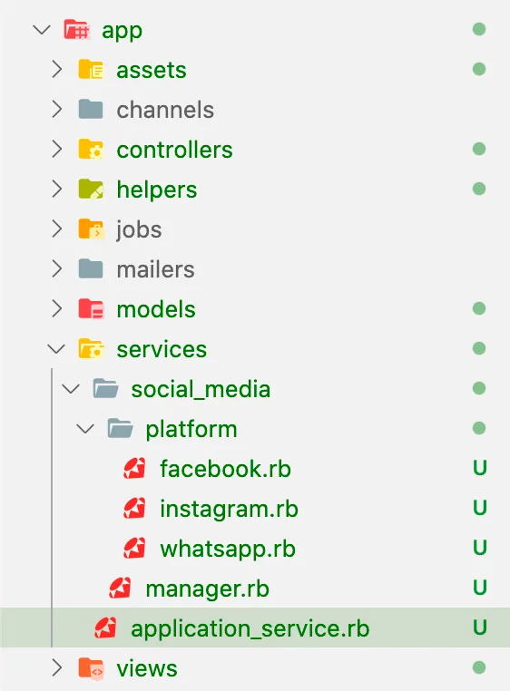
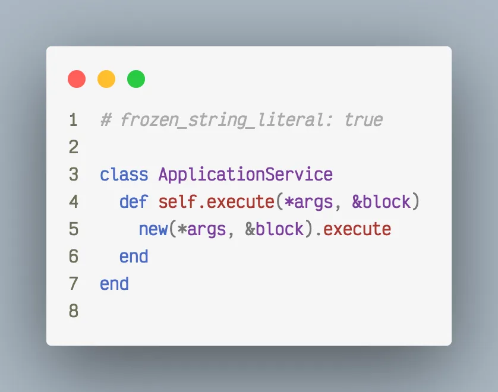
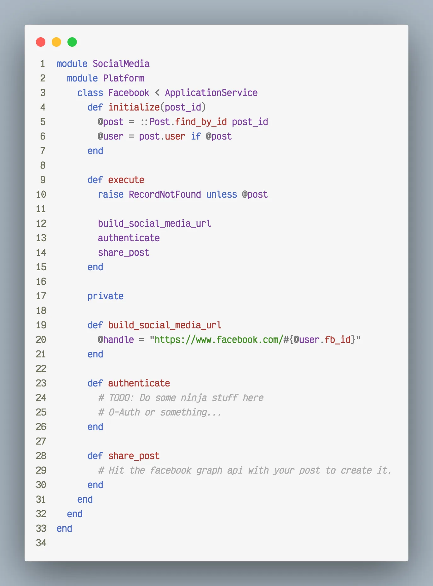

Don’t worry its just a version of typical corporate employee…

It’s a design pattern article and is independent of language you implement it into.

## Introduction

So, Service Objects, seems fancy, right? Well let me tell you this is what you have been doing all along in a slightly un-organized way. Don’t take it in a bad way, we already established in our previous article that you are awesome, you create thing from nothing, that's like god and trust me the big dude is the most awesome.
Since, you are motivated enough now, we can take a look at problem in hand. Let’s consider below situation and tell me if its good to keep that logic in a model or a controller or anywhere in traditional MVC setup if we are targeting long term plans:

- **Our models:** _User & Post._
- **Feature:** _User should be able to share post on social media, say Facebook._
- **Non-ninja solution:** _Create a method in Post model “share_to_facebook” taking maybe 200 lines of code._
- **Problem:** _Then a requirement comes to share to instagram and then to WhatsApp and then to whatever kids are using these days. Your model will become more fat than that sumo dude._
- **Ninja Solution:** _Use service objects and call them based on platform types._

Okay, enough talking, let's know what makes an object **Service Object. 😇**

1. **There should be only one public facing method and humans keep its name same across application, not change from file to file.**
2. **Humans also like to make a base service to make call easier.**
3. **Each service object does exactly one service. It's not that cool dude who plays guitar and soccer at same time.**

> **Let’s solve the imaginary problem we created above.**

Some generic setup, aka, User has_many posts and Post belongs_to an User:

```bash
rails g scaffold User name email facebook_id instagram_id whatsapp_id
rails g scaffold Post title body:text user:references
```

> Now, let’s go to services part. We’ll start by creating a services folder in our app directory to keep them organised. Overall structure is going to look like:


_app directory structure to hold all services._

Tech aside for a moment, to make life easier consider service objects as regular people offering you services, it will help you visualise better.

> So, we have a **social_media** department, which has a **manager,** who manages many platforms, he keeps his platform knowledge in a box named **platform** to organise better, whenever he needs to work on certain platform, he picks his platform of choice **Facebook, Instagram, WhatsApp, etc.** and gets the work done.
>
> Somewhat like Neo from Matrix movie.

Start by creating a base service, say **ApplicationService**, because literally every other thing in rails is called ApplicationController/Helper/Record/etc.


_Base service for every other service object in application._

You must be wondering why I did this. So, **execute** is the only public method I’ll use in all my services, like **Service.execute(params).** This little guy will help me get rid of creating an Object to use it, above is basically fancy style for **Service.new(params).execute.**

### Now lets go for defining our manager


_app/services/social_media/manager.rb_

What you need to notice here is use of meta-programming concepts. We are dynamically calling the matching platform service based on platform type passed in params. Kinda cool, Hell yeah, I was overwhelmed first time too.

### Now the actual platforms need to be defined. All of them will follow same pattern but actual implementation will differ in internal methods as per business logic


_app/services/social_media/platform/facebook.rb_

> To share the post to facebook, you can invoke service as:
>
> **SocialMedia:: Manager.execute(post, : facebook)**

> Now, it’s the time when I must say, **THAT’S ALL FOLKS. 😇**
>
> READ IT, DIGEST IT and then IMPLEMENT IT.

Share, Discuss, Learn and Support others, if you liked it… 😊