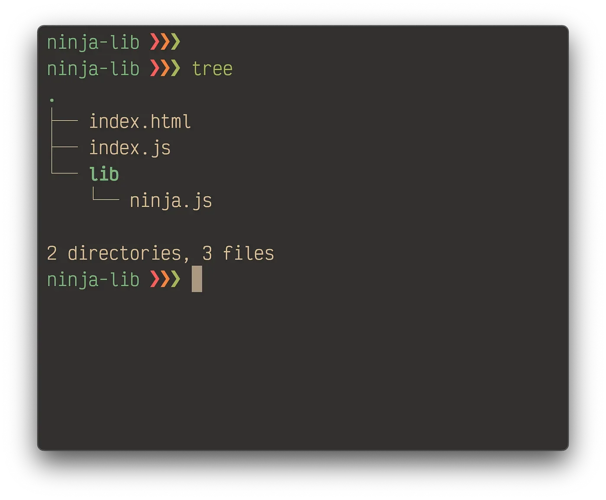
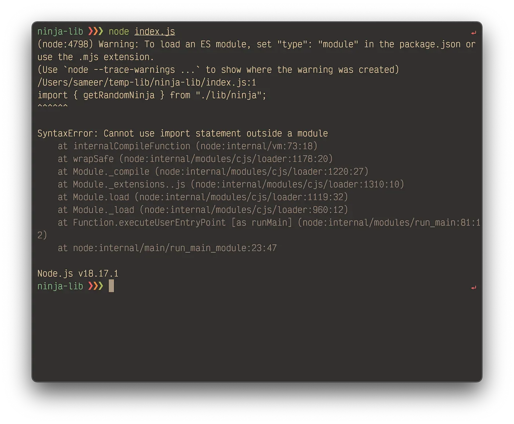
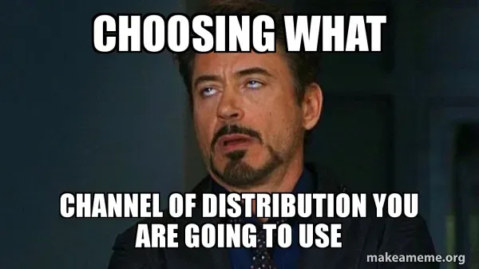
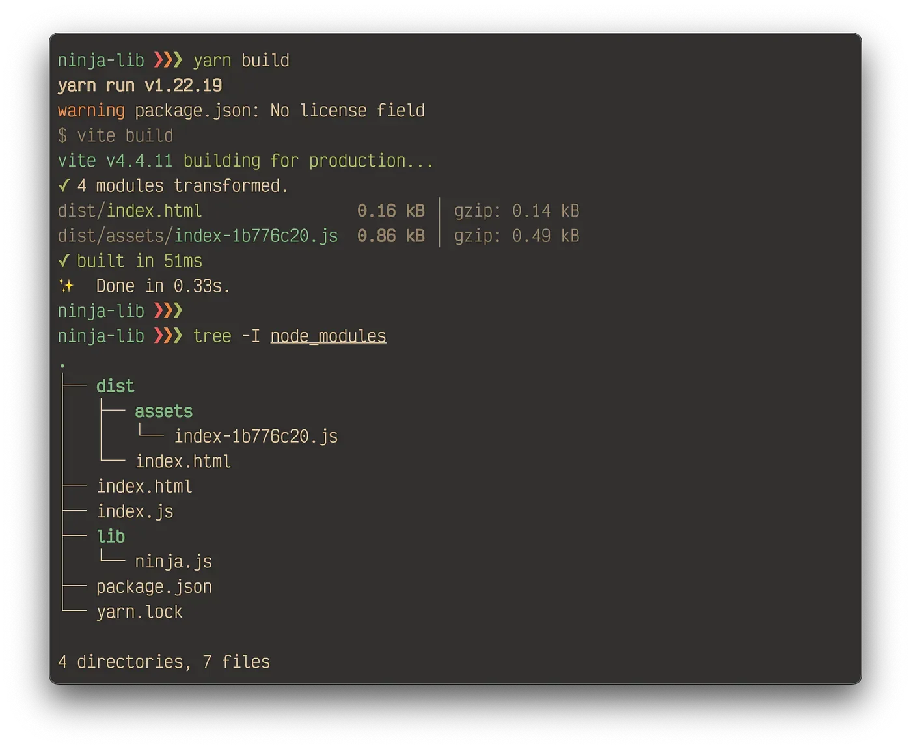
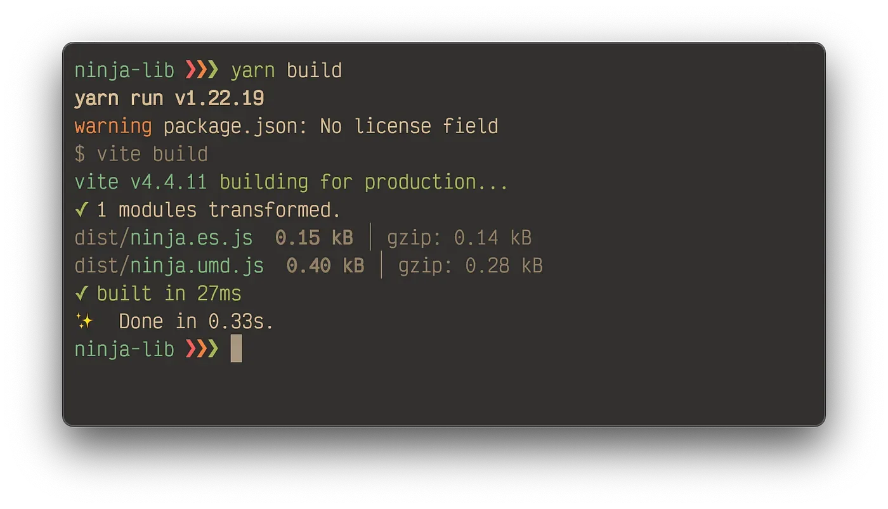
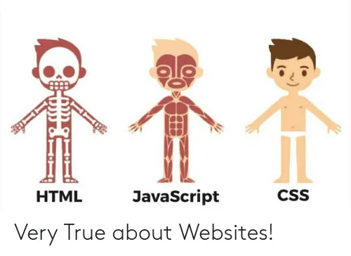
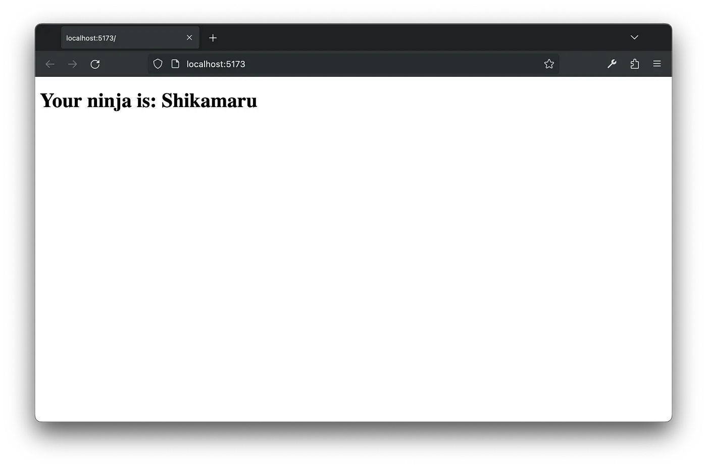
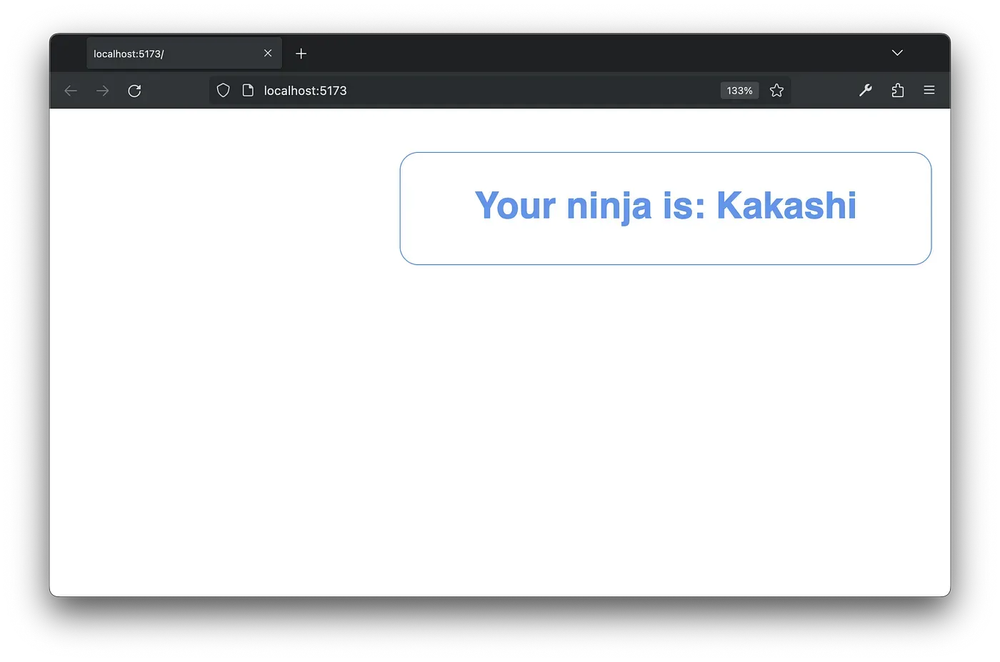

JavaScript libraries! Every man and his dog has a `node_modules` folder full of them. This article will be more or less a pragmatic guide to writing these without going neck-deep in history and theory. 

Let’s get started. First of all, a bit of pseudo-nomenclature. For all intent and purposes, we will classify libraries into two sections: 
1. Utilities: Non-UI libraries, as in these libraries, will provide functionalities in JavaScript without manipulating the DOM. For example, Lodash gives us a function to sort an array. 
2. Components: UI manipulation libraries, which mainly intend to manipulate the DOM. For example, a react component library like material UI. 

Intuitively, it’s clear that building utilities is easier than building components because of the technical stack’s width involved. What the particular library internally does is beyond our scope. We will focus on how to pack, distribute, and use them. 

Setup the Most Basic Example 
============================ 

> Remember, in most cases a good library is a decoupled section of your application that you want to distribute to others. Folder structure:



You can get the idea by looking at the example application I have set up. Codes living in the `lib` folder, don’t directly link to the business logic of the main application.

For our first example, we are building a utility library that returns a random ninja’s name using a highly complex randomization logic. Let’s look at the file contents:

```
// lib/ninja.js

const ninjas = ["Kakashi", "Itachi", "Shikamaru"];

export function getRandomNinja() {
  return ninjas[Math.floor(Math.random() * ninjas.length)];
}
```

```
// index.js

import { getRandomNinja } from "./lib/ninja";

console.log(getRandomNinja());
```

```
<!-- index.html -->

<!doctype html>
<html>
  <body>
    <h1 id="name"></h1>
  </body>

  <script type="module">
    import { getRandomNinja } from "./lib/ninja.js";

    const ninja = getRandomNinja();
    document.getElementById("name").textContent = ninja;
  </script>
</html>
```

Looks good. Let’s try to run it. A flying brick received right in the face. Hey, we are positive people. We are going to look into it. No worries!



\>>> node index.js

Modular JavaScript (MJS)
------------------------

The error looks straightforward. Let’s try to look into the second suggestion before dialing into the whole `node_modules` ecosystem. We are going to rename those JS files to the mjs extension. And voila! It works. Even the HTML example started working as expected after changing the extension of the referenced file there.

```
ninja-lib ❯❯❯ node index.mjs
Shikamaru
ninja-lib ❯❯❯
```

For its help, mjs definitely deserves a discussion here. MJS is an acronym for Modular JavaScript.

So, officially, there are two flavors of JavaScript: one regular one and another that imports and exports modules “natively.” There are technical differences in their internal implementation and scope resolution, but let’s not get ahead of ourselves.

> MJS is newer and may not work in a Neanderthal’s machine running Internet Explorer, but for common masses, its good to go.

Here comes package.json
-----------------------

Now, we’re revisiting the previous suggestion of using a `package.json` file. Apart from the internal cons of mjs, the main reason for the former approach being widely accepted is because of more familiarity with devs and machines.

We rolled back those mjs extensions to regular js files and added this bare-bone `package.json` file at the root of our project. Notice we mentioned it’s a module here. Everything works as expected!

```
// package.json

{
  "name": "ninja-lib",
  "author": "Sameer Kumar",
  "type": "module",
  "version": "1.0.0",
  "description": "Library for finding real ninjas",
  "main": "index.js",
  "directories": {
    "lib": "lib"
  }
}
```

This `lib` folder is now ready for shipping. You can push it to GitHub or npm. Each platform has a very easy quick start guide to publish there; nothing too technical involved. Your users get exactly what you have written in the `lib` folder — no surprises packaged. This works well depending on the complexity of your library and how much less it depends on other libraries.

Stepping Up With Distribution Strategies
========================================



Now that we have written something, we want to distribute it to other folks in a clean “packaging.” After all, we just added a `package.json` file, so the name should carry the weight.

A module/library can be packaged in a few well-accepted formats. Some techniques are:

**UMD (Universal Module Definition)**
-------------------------------------

UMD is a versatile module format that works in all environments, including in the browser. It provides a way to create modules that can be used with minimum expectations from the consumer.

Forget the mumbo-jumbo, remember the `script` tag from the golden days. You’ll go for this packaging if you want to simply import in an HTML file and move on like we used to in our beloved jQuery. Here’s what that looks like:

```
<!-- index.html -->

<!doctype html>
<html>
  <body>
    <h1 id="name"></h1>
  </body>

  <script src="https://code.jquery.com/jquery-3.7.1.js"></script>
</html>
```

**ES6 Modules (ESM)**
---------------------

ECMAScript Modules (ESM) are a native module system for JavaScript, and modern browsers and Node.js support them. They use `import` and `export` statements to define and load modules.

We have already done an example of this format in our previous ninja finder example. Here’s the code:

```
// calculator.js

export function sum(a, b) {
  return a + b;
}
```

```
// index.js

import { sum } from "calculator.js";

console.log(sum(2, 2));
```

**CommonJS (CJS)**
------------------

CommonJS is a module system used primarily in Node.js. It uses the `require` and `module.exports` (or `exports`) syntax to define and import modules.

No wonder you have seen it once or twice. It is the predecessor to the ES6 `import`/`export` syntax we used in our above example. It is slowly fading out of even the backend development ecosystem in favor of the ES6. You must have seen it in Express apps.

_It’s very important to consider this packaging format if you are shipping your library for both frontend and backend._

```
// calculator.js

const sum = (a, b) => {
  return a+b;
};

exports.sum = sum;
```

```
// index.js

const calculator = require('./calculator');
console.log(`2 + 2: ${calculator.sum(2, 2)}`);
```

Many more of these formats are custom-tailored for specific use cases, but the above three should be good enough for us potato developers. ;)

Honorable mentions should extend to SystemJS and AMD (Asynchronous Module Definition) as well.

Bundling Systems
================

Now, the real fun starts. You don’t want the user to import 42 separate js files to handle other files that need to be imported. To be honest, your user won’t take a look at your library either. It should be as close to a one-click installation as possible. As seen in the UMD example above, we added a ton of jQuery features just by adding one line of script tag.

Some common bundling toolchains build your application/library into an optimized distributable bundle. The strategy can vastly differ from everything bundled into a single js file or split into chunks that automatically load when needed. A few big names in this game are:

1.  Webpack
2.  Rollup
3.  Parcel
4.  esbuild
5.  SWC

Each one has its own nuances, but for us, all are doing the same work of bundling. Some are faster, some are more extensible, some are more supported, etc.

For our purpose, nothing matters. When choosing one for your project, you’ll do deep analysis for sure. One that I can suggest, which works well, is a tool called [Vite](https://vitejs.dev/). Vite is not a bundler but a build framework that internally uses esbuild and Rollup for bundling. Let's implement it in our ninja application.

Adding Vite to Existing Application
===================================


<figcaption>https://vitejs.dev</figcaption>

Adding Vite is super simple. Let’s add it to our `package.json` file. Notice the `scripts` and `devDependencies` sections. Run `npm install` or `yarn` to install the new dependencies we added. Here’s what that looks like:

```
// package.json

{
  "name": "ninja-lib",
  "type": "module",
  "version": "1.0.0",
  "description": "Library for finding real ninjas",
  "scripts": {
    "dev": "vite",
    "build": "vite build"
  },
  "devDependencies": {
    "vite": "^4.4.5"
  }
}
```

With it installed, we are ready to roll with all the goodies with Vite, especially my favorite, hot reload. Before we start our dev server, let’s make some changes so the code will accept Vite.

Using Vite for a single-page application
----------------------------------------

By default, Vite looks for the `index.html` file in the root directory, so we are good there for now. Let’s simplify the HTML a bit by adding the following code:

```
<!-- index.html -->

<!doctype html>
<html>
  <body>
    <h1 id="name"></h1>
  </body>

  <script src="./index.js" type="module"></script>
</html>
```

```
// index.js

import { getRandomNinja } from "./lib/ninja.js";

document.getElementById("name").innerHTML = getRandomNinja();
```

That is all. Nothing else is needed to run the application. We can start the application by doing `npm run dev` or `yarn dev`. A local server will run and manage our application on a certain port `5173` by default. All properties of Vite can be configured by adding a `vite.config.js` file at the project’s root.

The application can be optimized and built by running `npm run build` or `yarn build`. It creates a distribution folder, `dist`, which contains one HTML and js file that encapsulates the entire application. Even if we add ten more files, the output will still produce the same two files. And hence came the name of the process, bundling.


<figcaption>yarn build</figcaption>

Using Vite to build libraries
-----------------------------

Hey, hey, hey, where did we go in the flow? We were building a library, not another single-page application. Oopsies, my bad!

Let’s add the `vite.config.js` file we talked about earlier. Here, we instructed Vite to build a library and also pointed to the main file of our library, as you can see below:

```
// vite.config.js

import { defineConfig } from "vite";
import path from "path";

export default defineConfig({
  build: {
    lib: {
      entry: path.resolve(__dirname, "./lib/ninja.js"),
      name: "Ninja",
      fileName: (format) => `ninja.${format}.js`,
    },
  },
});
```

Upon running the `build` command again, we see that now the `dist` folder only contains the library we want to ship — thankfully, in two flavors by default. `ninja.es.js` works better as an npm package but `ninja.umd.js` will be better as a script tag. Note that we can configure it to churn out other formats, too.


<figcaption>yarn build</figcaption> 

Let's chime into the magic now. Here, we added a new `demo.html` file that has literally no connection to our application. We got our application working by importing it as a simple js script, not even `type=“module”`.

```
<!-- demo.html -->

<!doctype html>
<html>
  <body>
    <h1 id="name"></h1>
  </body>

  <script src="./dist/ninja.umd.js"></script>
  <script>
    const ninja = Ninja.getRandomNinja();
    document.getElementById("name").textContent = ninja;
  </script>
</html>
```

Let’s get “modern” and use ESM build as well. Works like a charm.

```
import { getRandomNinja } from "./dist/ninja.es.js"; // library name later

document.getElementById("name").innerHTML = getRandomNinja();
```

Though this may look similar to what we were doing earlier, on the bright side, this one import can have hundreds of files clubbed and optimized in a single unit.

Building Components
===================




After going through all the foundational work, we are now ready to get into the real deal. Let’s imagine we are building a notification library of sorts. Calling js functions only is not going to suffice. We need to do some HTML of our own and, in turn, hook it to the user’s DOM as well.

Vite or any other build system can only bundle JavaScript as its core functionality. Our requirements have overgrown our capabilities. Anyway, let's give it a shot. We’ll make sure not to go in the same single-page application direction again.

We will display a message on the screen without end user intervention by using our own HTML. This can vary from a simple text to a self-contained application. Here’s what the code looks like:

```
<!-- notify.html -->

<h1 id="ninja-notify">
  <span>Your ninja is: </span>
  <span id="name"></span>
</h1>
```

```
// ninja.js

import notifyHTML from "./notify.html?raw";

const ninjas = ["Kakashi", "Itachi", "Shikamaru"];

function getRandomNinja() {
  return ninjas[Math.floor(Math.random() * ninjas.length)];
}

export function notifyNinja() {
  const notifyEl = document.createElement("div");
  notifyEl.innerHTML = notifyHTML;
  document.body.appendChild(notifyEl);
  document.getElementById("name").innerText = getRandomNinja();
}
```

```
// index.js

import { notifyNinja } from "./lib/ninja.js";

notifyNinja();
```

```
<!-- index.html -->

<!doctype html>
<html>
  <body></body>

  <script src="./index.js" type="module"></script>
</html>
```

Okay, all done. This setup will smoothly bring the component we created in our library to the consumer application. I played a trick regarding HTML files. Did you notice?

Using the above import syntax, we can inject HTML into the js file as if it were a raw string. This is super powerful in bundling because our bundler will otherwise error out, saying that it doesn’t identify the HTML file type. Makes sense, it is a JavaScript bundler, after all.

Rest assured, it builds correctly, and we get the same single-file builds in our `dist` folder, one for `umd`, and one for `esm`.



<figcaption>Demo HTML</figcaption>

The last piece is all about fusing our styles. CSS is a world with dozens of build systems just like JavaScript. One sane thing to do here is pray to our overlord, Vite, to manage it somehow. Luckily, Vite has a rich ecosystem of plugins (actually, esbuild and Rollup plugins).

Here, we have added one such plugin, `vite-plugin-css-injected-by-js`, that injects all CSS used in the library’s js files directly into the bundle, which will create a host application.

```
// package.json

{
  "name": "ninja-lib",
  "type": "module",
  "version": "1.0.0",
  "description": "Library for finding real ninjas",
  "scripts": {
    "dev": "vite",
    "build": "vite build"
  },
  "devDependencies": {
    "vite": "^4.4.5",
    "vite-plugin-css-injected-by-js": "^3.3.0"
  }
}
```

Adding some random styles

```
/* styles.css */

#ninja-notify {
  color: cornflowerblue;
  font-family: sans-serif;
  position: fixed;
  top: 1rem;
  right: 1rem;
  padding: 1em 2em;
  border: 1px solid cornflowerblue;

  border-radius: 0.5em;
}
```

```
// ninja.js

import notifyHTML from "./notify.html?raw";
import "./styles.css";

const ninjas = ["Kakashi", "Itachi", "Shikamaru"];

function getRandomNinja() {
  return ninjas[Math.floor(Math.random() * ninjas.length)];
}

export function notifyNinja() {
  const notifyEl = document.createElement("div");
  notifyEl.innerHTML = notifyHTML;
  document.body.appendChild(notifyEl);
  document.getElementById("name").innerText = getRandomNinja();
}
```


<figcaption>Demo HTML</figcaption>

And it works, no doubts there. The `dist` folder still consists of just a single JavaScript output, which contains HTML, CSS, and JavaScript, ready to be imported into the host application with zero configuration. If you have a larger library, then it will be better to keep bundles split for performance gains.

Final Words
===========

I hope this walk-through was somewhat helpful. There is a lot of tooling around single-page applications mainly due to the popularity of the mighty three: Angular, React, and Vue.

This guide is a bare minimum boarding point to help you explore the library. If you are/get stuck somewhere, feel free to reach out. Good luck. Craft something helpful!

Get the full code [at this link](https://github.com/sameer1612/ninja-lib).

Want to connect?
================

[LinkedIn](https://www.linkedin.com/in/sameerkumar1612/)

[Website](https://hi-sameer.vercel.app/)
