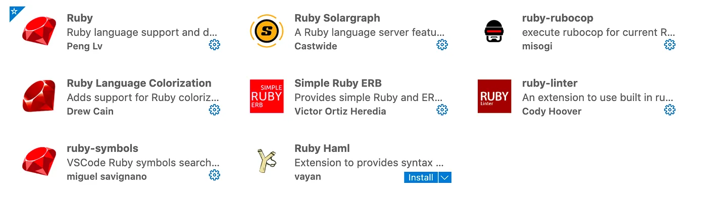
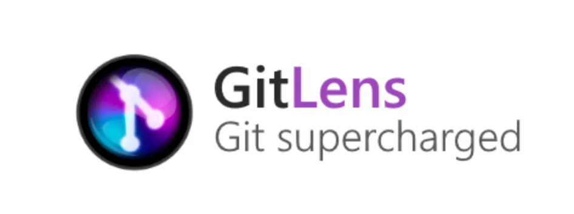
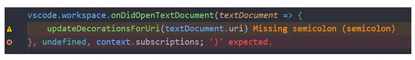
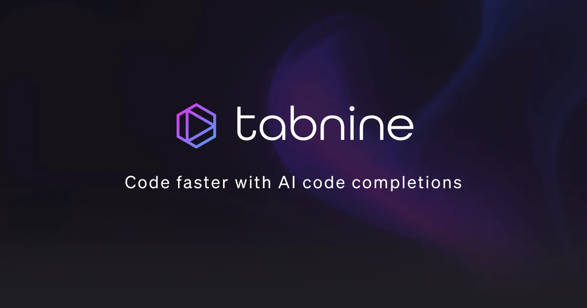
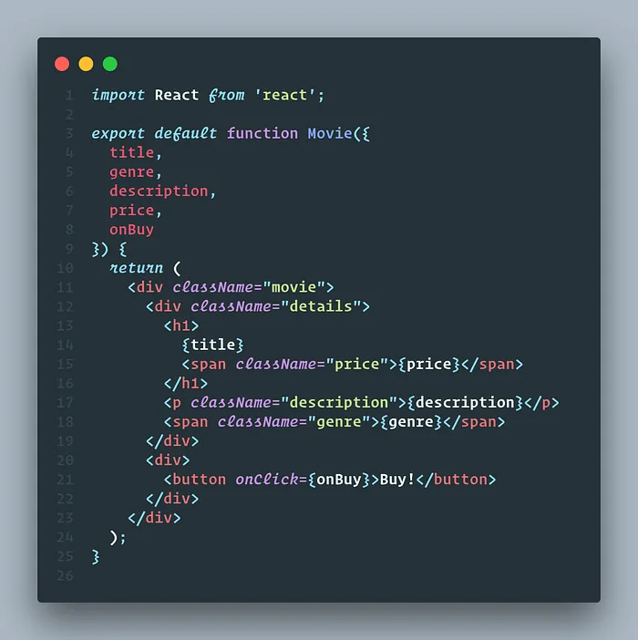

## Introduction

Your productivity is governed by your tool belt. Obviously, you can write code in a notepad or a terminal, but if productivity does count for you, then VS Code is the most customizable of all editors/IDEs. I am primarily a Ruby on Rails developer but the extensions I am recommending below count for all languages except the first one.

### 1. Ruby extension pack:

Well, in short, it’s not an extension but a collection of numerous ruby on rails extensions. This extension pack includes Ruby, Ruby Solargraph, ruby-rubocop, Ruby Language Colorization, Ruby Haml, Simple Ruby ERB, ruby-linter, ruby-symbols.

_Ruby extension pack for vscode_

Extension Link: [marketplace.visualstudio.com/items?itemName=walkme.Ruby-extension-pack](https://marketplace.visualstudio.com/items?itemName=walkme.Ruby-extension-pack)

### 2. Git Lens:

Yeah, that’s the famous turbocharger. I mainly use it to blame code, i.e, knowing who wrote the line which I am about to change.

GitLens **supercharges** the Git capabilities built into Visual Studio Code. It helps you to **visualize code authorship** at a glance via Git blame annotations and code lens, **seamlessly navigate and explore** Git repositories, **gain valuable insights** via powerful comparison commands, and so much more.

_Git Lens extension for vscode_

Extension Link: [marketplace.visualstudio.com/items?itemName=eamodio.gitlens](https://marketplace.visualstudio.com/items?itemName=eamodio.gitlens)

### 3. Error Lens:

Most certainly this is the cure for my OCD. ErrorLens turbo-charges language diagnostic features by making diagnostics stand out more prominently, highlighting the entire line wherever a diagnostic is generated by the language and also prints the message inline. Key features being:

- Highlight lines containing diagnostics
- Append diagnostic as text to the end of the line
- Show icons in the gutter
- Show message in the status bar

_Error lens extension for vscode_

Extension Link: [marketplace.visualstudio.com/items?itemName=usernamehw.errorlens](https://marketplace.visualstudio.com/items?itemName=usernamehw.errorlens)

### 4. Tabnine - AI Code Completion:

Whether you call it **IntelliSense, intelliCode, autocomplete, AI-assisted code completion, AI-powered code completion, AI copilot, AI code snippets, code suggestion, code prediction, code hinting**, or **content assist**, you probably already know that it can save you tons of time, easily cutting your keystrokes in half. Whether you’re just getting started as a developer or if you’ve been doing it for decades, Tabnine will help you code twice as fast — all in your favourite IDE.

_Tabnine extension for vscode_

Extension Link: [marketplace.visualstudio.com/items?itemName=TabNine.tabnine-vscode](https://marketplace.visualstudio.com/items?itemName=TabNine.tabnine-vscode)

### 5. CodeSnap:

If you have seen my previous blogs, almost all of them contained a code screenshot at least. CodeSnap is really simple to use just select the code and it will generate a mac-ish screenshot for it on the fly. Features included:

- Quickly save screenshots of your code
- Copy screenshots to your clipboard
- Show line numbers

_CodeSnap extension for vscode._

Extension Link: [marketplace.visualstudio.com/items?itemName=adpyke.codesnap](https://marketplace.visualstudio.com/items?itemName=adpyke.codesnap)

Do comment if you guys have explored any hidden gem in the jungle of VS Code extensions that tops your recommendation list.