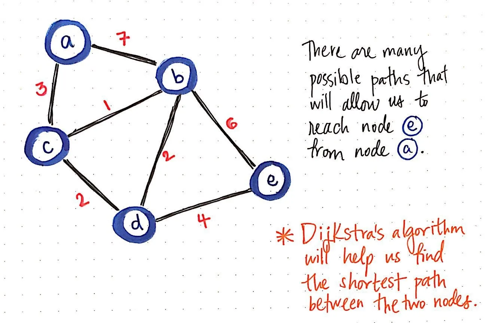

## Introduction
============

From the last article, I got some questions, summing up in one major query, “It's good and all, but why does everyone need to know it. There are many disciplines of engineering which doesn’t require it. I am working for the past 5 years but never needed to implement any of these”. Let's create some hypothetical questions and find out the answer to those together.

## Why learn competitive programming?
==================================

> “Competitive programming is a sport just like Cricket, Football, Swimming, etc.”

Why learn competitive programming?

If you want to become a famous Olympic champion swimmer like, Michael Phelps, you need to practice, practice a lot, then compete with a lot of people. The same goes for a career in programming, if you want to become a rockstar programmer then you need to practice a lot of programming and compete with a lot of other programmers to find your current place in the hierarchy. I don’t think or recommend anyone to think more than above whenever this question pops up in your mind. Please, don’t patronize it any more than it needs to otherwise you’ll start fearing it instead of adoring it.

## Why practice data structures and algorithms?
============================================

Why practice data structures and algorithms?

> Before unlocking 6th sense, first, master common sense.

Let’s answer this question first, “I am working for the past 5 years but never needed to implement any of these”. Someone was working comfortably for the past 5 years because an excellent programmer contributed to coding the code editor so that he/she can see all those intelligent suggestions and find their errors before you push code. Harsh but in reality, **You are customers to that finer breed of programmers.**

Enough demotivation, now let’s consider the ground reality. If someone is happy with just creating random buttons and static pages, forcing them to become someone they never wanted is a sin in itself. Reinventing the wheel is not recommended for anyone, but if you are an engineer understanding how a wheel works, should be your common knowledge.

Daring to take a leap and understanding how to reach a certain solution is important not only because your problem gets solved but also in the future you’ll be able to solve problems branching from similar concepts rather easily. Data structures are well-tested utilities in form of which you can model your real-world problem into your comfortable imaginary world. On the other hand, algorithms are just the steps you performed on a general-purpose data structure to create a custom-tailored solution to your specific problem.

**For example:**

Every engineer wants to work at **Google**. Let's say you join google and get posted in the **google flights** team. A very real problem will be to find the cheapest/shortest flight between two cities either direct or connecting flights.

Google flights algorithm

Good luck if you find a direct flight from your DB by doing some SQL queries, but if direct flights don’t exist you’ll have to write an **algorithm** based on a **graph data structure** where each node represents a city and your objective is to find the shortest route between two nodes of a graph.

> That bunked class from engineering college, rings a bell?

Shortest path algorithm.

## What is the relation between competitive programming and DSA?
=============================================================

The answer to this question is simple and it's **Nothing**. CP and DSA have nothing in common but if not DSA then what? I tried imagining many things but I couldn’t find anything that is as quantifiable and fundamental as DSA. Let’s say, you want to buy a TV, you can judge it on the basis of many factors like country of origin, body color, bezels, price, brand, etc. but if you got to establish a single metric to mass judge all TVs in the world, I don’t think anything comes even remotely close to “Picture Quality”.

The same is the relation between competitive programming and DSA. It exists because we should judge programmers on basis of something fundamental that is expected out of everyone and doesn’t require very precise training in a particular area. Saying that there is a ton of places where you can compete in your own area, for example, if you want to compete in your **CSS** skills take a look at [https://cssbattle.dev](https://cssbattle.dev). There is a site dedicated to every area of programming, you just need to get out of your comfort zone and explore. Best of luck!

## Conclusion
==========

Having spoken all in favor of CP and DSA, I’ll like to conclude with a rather sad note. It was meant to be used not abused. People and companies started to weigh the potential of a candidate just on the basis of DSA. Companies like **FAANG** earned a bad reputation for the same. To a great extent, it seems okay for them as they get 1000s of applications every day and they need to judge them equally. But, even niche companies are inclining more towards this as a recruitment practice and thus creating a foul market where these topics worth learning are spoonfed. Entire youtube is flooding with, “How to crack amazon” kind of videos. Websites like leetcode, hacker rank, CodeChef, etc are being used solely for purpose of getting a job. I wonder what percentage of their user base continues practicing after landing up a fancy job.

> These tools exist to bring order to the chaos, solve problems, fuel up projects but were never imagined as a passport to a high-paying job.

## To Connect
==========

🏭 LinkedIn: [https://www.linkedin.com/in/sameerkumar1612
](https://www.linkedin.com/in/sameerkumar1612/)🏠 Website: [https://hi-sameer.web.app](https://hi-sameer.web.app/)

